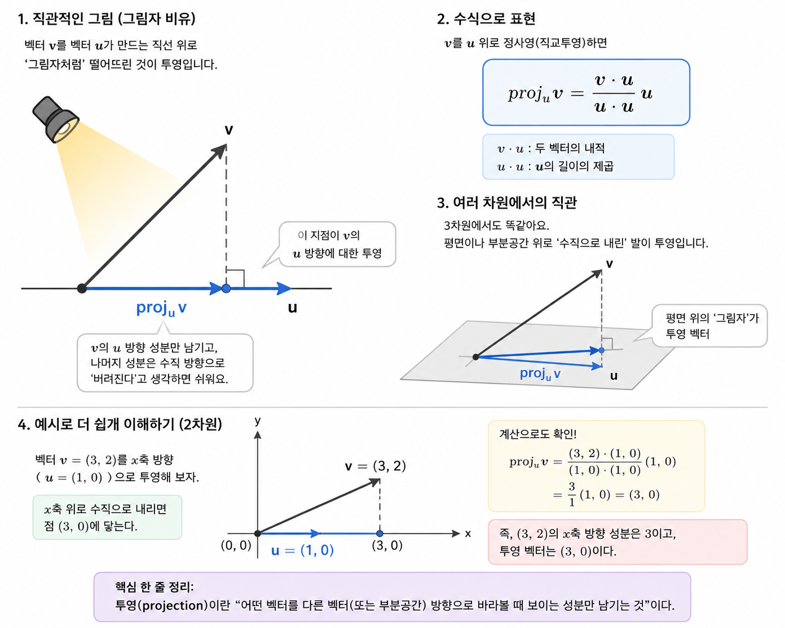

# 선형대수 직관

AI 모델은 결국 벡터와 행렬을 다루는 계산이다. 이 문서는 선형대수의 핵심 개념이 실제 AI에서 어떻게 쓰이는지 직관적으로 이해하고, 간단한 코드로 직접 구현해보는 것을 목표로 한다.

## 핵심 개념

- 벡터는 점이자 방향이다.
- 행렬은 벡터를 다른 벡터로 바꾸는 변환이다.
  - 행렬은 선형함수
- 내적은 두 벡터가 얼마나 비슷한지 나타낸다.
  - 양수는 같은 방향(유사함)
  - 0은 수직(관련 없음)
  - 음수는 반대 방향(비유사함)을 의미합니다. 
  - 인공지능에서 유사성 검색의 기본 원리입니다.
- 선형독립은 어떤 벡터도 다른 벡터들의 조합으로 만들 수 없는 상태다.
- 기저는 공간을 표현하는 최소한의 독립 벡터 집합이다.
- 차수(rank)는 행렬 안에 실제로 독립적인 정보가 얼마나 있는지 보여준다.
- 투영(projection)은 한 벡터를 다른 벡터 방향으로 “그림자처럼” 내려놓는 것이다.
  - 
- Gram-Schmidt는 독립 벡터들을 서로 직교하는 정규 직교 기저로 바꾸는 과정이다.

## AI와의 연결

- 임베딩은 단어, 이미지, 사용자 같은 대상을 벡터로 표현한 것이다.
- 신경망의 가중치는 행렬이며, 입력을 다른 공간으로 변환한다.
- Attention은 벡터 간 유사도를 계산하는 과정이다.
- LoRA는 큰 가중치 행렬을 저차원 행렬로 분해해 적은 파라미터로 미세조정하는 기법이다.

## 직접 구현해볼 내용

- Python으로 벡터 덧셈, 내적, 크기, 정규화 구현
- Python으로 행렬-벡터 곱과 행렬 곱 구현
- 선형독립성, 정사영, Gram-Schmidt 구현
- NumPy로 같은 연산을 다시 확인
- PyTorch에서 텐서와 자동미분이 어떻게 동작하는지 확인

## 환경 메모

- NVIDIA GPU가 있으면 CUDA를 사용할 수 있다.
- Mac의 Apple Silicon GPU는 CUDA가 아니라 MPS를 사용한다.
- 이 환경에서는 `nvidia-smi` 대신 MPS 지원 여부를 확인한다.

## 한 줄 요약

선형대수는 AI 모델이 데이터를 공간 안에서 어떻게 이동, 비교, 압축, 변환하는지 이해하게 해주는 언어다.
