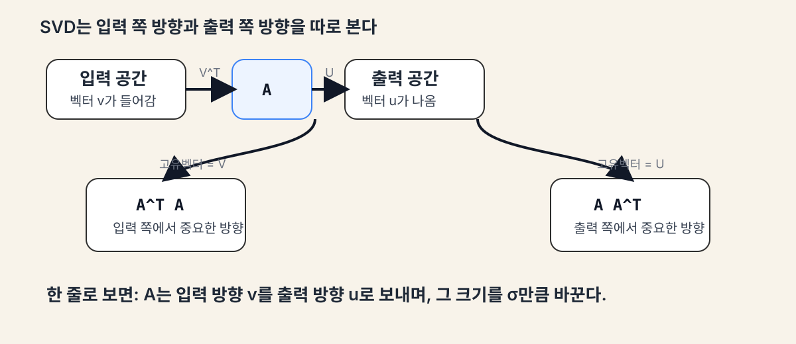
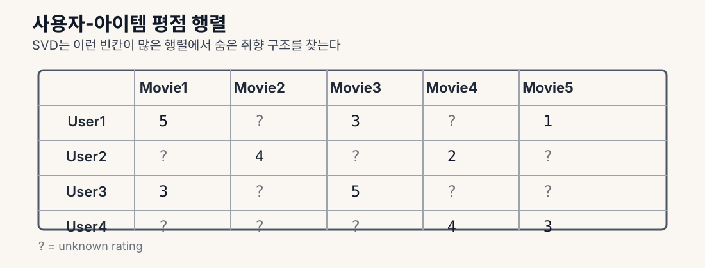

# 특이값 분해

특이값 분해(SVD)는 어떤 행렬이든 `회전 -> 늘리기/줄이기 -> 회전`으로 나눠 보는 방법이다.  
모양이 정사각형이 아니어도 되고, rank가 낮아도 된다. 그래서 압축, 노이즈 제거, 추천 시스템, PCA 같은 곳에서 아주 많이 쓰인다.

한마디로, SVD는 큰 행렬을 잘게 쪼개서 겉으로는 안 보이던 숨은 구조를 드러내는 도구다.

## SVD의 구조

행렬 `A`는 보통 이렇게 쓴다.

```text
A = U Σ V^T
```

- 행렬은 입력 공간의 점을 출력 공간의 점으로 보내는 선형 변환이다
- 그래서 입력 차원 `n`과 출력 차원 `m`이 달라도 된다

예를 들어 `A`가 `3 x 2` 행렬이라면:

```text
A = U Σ V^T

U   : 3 x 3
Σ   : 3 x 2
V^T : 2 x 2

(3 x 3) @ (3 x 2) @ (2 x 2) = (3 x 2)
```

즉, 입력과 출력의 차원이 서로 다를 수 있다.
그래서 `V^T`는 입력 쪽 차원에 맞고, `U`는 출력 쪽 차원에 맞는다.

- `V^T`는 입력 공간을 회전시킨다
- `Σ`는 각 방향을 서로 다르게 늘리거나 줄인다
- `U`는 결과를 출력 공간으로 다시 회전시킨다

예를 들어 `A`가 `3 x 2` 행렬이면 실제 모양은 이렇게 볼 수 있다.

```text
A = U Σ V^T

U   = | u11  u12  u13 |      (3 x 3)
      | u21  u22  u23 |
      | u31  u32  u33 |

Σ   = | σ1   0  |           (3 x 2)
      | 0    σ2 |
      | 0    0  |

V^T = | v11  v21 |          (2 x 2)
      | v12  v22 |
```

이때
- `U`의 각 열은 좌측 특이 벡터다
- `V`의 각 열은 우측 특이 벡터다
- `Σ`의 대각선 값은 특이값이다

쉽게 말하면:
- 입력을 한 번 돌리고
- 중요한 축으로 늘리고/줄인 다음
- 다시 원하는 방향으로 돌린다

## 각 요소의 뜻

- `U`의 열벡터는 좌측 특이 벡터다
- `V`의 열벡터는 우측 특이 벡터다
- `Σ`의 대각선 값은 특이값이다

특이값은 항상 0 이상이고, 보통 큰 순서대로 본다.

핵심 관계는 다음과 같다.

```text
A v_i = σ_i u_i
```

- `v_i`를 넣으면
- `σ_i`만큼 크기가 바뀌고
- `u_i` 방향으로 이동한다

즉, SVD는 행렬이 각 방향에 얼마나 강하게 작용하는지를 보여준다.

그림으로 보면 이렇게 생각할 수 있다.



- `A^T A`를 보면 입력 쪽에서 어떤 방향이 중요한지 보인다
- `A A^T`를 보면 출력 쪽에서 어떤 방향이 중요한지 보인다
- 그래서 `V`는 입력 쪽 방향, `U`는 출력 쪽 방향으로 연결된다

## 고유값 분해와의 관계

SVD와 고유값 분해는 서로 아주 가깝다.

- `A^T A`의 고유벡터는 `V`와 같다
- `A^T A`의 고유값은 `Σ`의 대각값을 제곱한 것과 같다
- `A A^T`의 고유벡터는 `U`와 같다
- `A A^T`의 고유값도 `Σ`의 대각값을 제곱한 것과 같다

즉, SVD는 `A^T A`와 `A A^T`의 구조를 동시에 보여준다.
이 관계 덕분에 특이값은 항상 0 이상이고, PCA도 SVD로 계산할 수 있다.

## 랭크와 저차원 근사

SVD는 행렬을 여러 개의 rank-1 조각으로 쪼갤 수 있다.

```text
A = σ_1 u_1 v_1^T + σ_2 u_2 v_2^T + ...
```

- 가장 큰 특이값이 가장 중요한 패턴을 담는다
- 그다음 특이값은 다음으로 중요한 패턴을 담는다
- 앞쪽 몇 개만 남기면 좋은 근사값이 된다

이렇게 일부만 남기는 것을 truncated SV(절단된 SVD)라고 한다.

## PCA와의 관계

PCA는 중심을 맞춘 데이터에 SVD를 적용한 것과 사실상 같다.

- PCA가 찾는 주성분 방향과 SVD가 찾는 우측 특이벡터 방향은 같다
- 공분산 행렬의 고유벡터는 SVD의 우측 특이벡터와 연결된다
- 설명된 분산은 특이값의 제곱과 연결된다
- 그래서 PCA는 SVD를 통해 더 안정적으로 계산할 수 있다

즉, 차원 축소에서 배운 PCA는 SVD가 안쪽에서 일하는 대표적인 예다.

## 이미지 압축

흑백 이미지는 픽셀 값의 행렬로 볼 수 있다.  
SVD로 rank를 줄이면 중요한 구조는 남기고, 세부 정보는 줄일 수 있다.

- 작은 rank는 저장 공간을 줄여준다
- 첫 몇 개의 특이값은 윤곽이나 큰 덩어리를 잘 담는다
- 뒤쪽 특이값은 세부 디테일이나 노이즈를 많이 담는다
- 예를 들어 rank 50에서 잘라내기를 하면 원본과 거의 비슷한 이미지를 얻으면서 저장 공간을 크게 줄일 수 있다

즉, `rank-k` 근사는 이미지를 더 적은 정보로 표현하는 방법이다.

## 추천 시스템

사용자-아이템 평점 행렬도 SVD로 잘 다룰 수 있다.



- 사용자 취향은 몇 개의 숨은 요인으로 설명되는 경우가 많다
- 예를 들어 액션/로맨스, 밝은/어두운 분위기 같은 요인이다
- SVD는 이 숨은 요인 공간을 찾아서 빈 평점을 예측하는 데 도움을 준다

즉, SVD는 사용자와 아이템을 몇 개의 숫자 벡터로 바꾸는 방법으로 볼 수 있다.
- 사용자는 취향 벡터를 갖는다
- 영화도 특징 벡터를 갖는다
- 두 벡터가 비슷할수록 평점이 높아진다고 본다

쉽게 말하면:
- `사용자 벡터 · 영화 벡터 = 예측 평점`

## NLP에서의 활용

Latent Semantic Analysis는 단어-문서 행렬에 SVD를 적용한다.

- 비슷한 의미의 단어는 비슷한 문서에서 같이 나온다
- SVD는 이런 구조를 잠재 의미 공간으로 묶어준다
- 그래서 문서와 단어를 더 적은 차원에서 비교할 수 있다

쉽게 말하면:
- SVD는 단어와 문서의 숨은 관계를 압축해서 보여준다

## 노이즈 제거

- 신호는 보통 앞쪽 특이값에 많이 모인다
- 노이즈는 뒤쪽 특이값에 넓게 퍼진다
- 그래서 작은 특이값을 버리면 노이즈를 줄일 수 있다

즉, SVD는 “중요한 신호만 남기고 잡음을 덜어내는 필터”처럼 쓸 수 있다.

## 유사역행렬

SVD를 쓰면 유사역행렬을 쉽게 구할 수 있다.

```text
A+ = V Σ+ U^T
```

- `Σ+`는 0이 아닌 특이값만 뒤집은 행렬이다
- 정방행렬이 아니어도 최소제곱해를 구할 수 있다
- 역행렬이 없는 경우에도 유용하다

이 때문에 SVD는 과잉결정 시스템을 푸는 데 자주 쓰인다.

## 최소제곱 문제

유사역행렬은 `Ax = b`에 정확한 해가 없을 때 가장 가까운 해를 찾는 데 쓴다.

- 과잉결정 시스템은 식이 더 많아서 정확히 맞는 `x`가 없을 수 있다
- 이때 `x = A+ b`는 오차 제곱합을 가장 작게 만드는 해다
- 즉, `||Ax - b||`를 최소화하는 해를 준다

정규방정식

```text
(A^T A)^-1 A^T b
```

과 같은 결과를 주지만, SVD를 쓰는 쪽이 보통 더 안정적이다.

## 수치적 안정성

`A^T A`를 직접 분해하면 특이값이 제곱되면서 조건수도 더 커진다.

- 작은 오차가 더 크게 증폭될 수 있다
- 그래서 `np.linalg.svd(A)`처럼 `A`에 바로 SVD를 적용하는 편이 낫다
- `np.linalg.eig(A.T @ A)`보다 숫자적으로 덜 흔들린다

즉, SVD는 이론적으로도 깔끔하고 계산적으로도 더 안전하다.

## 세 가지의 관계

- 유사역행렬은 해를 구하는 수단이다
- 최소제곱은 그 해가 만족해야 하는 목표다
- 수치적 안정성은 그걸 얼마나 정확하게 계산하느냐를 뜻한다

즉, 유사역행렬은 최소제곱 해를 구하게 해주고, SVD는 그 계산을 안정적으로 해준다.
