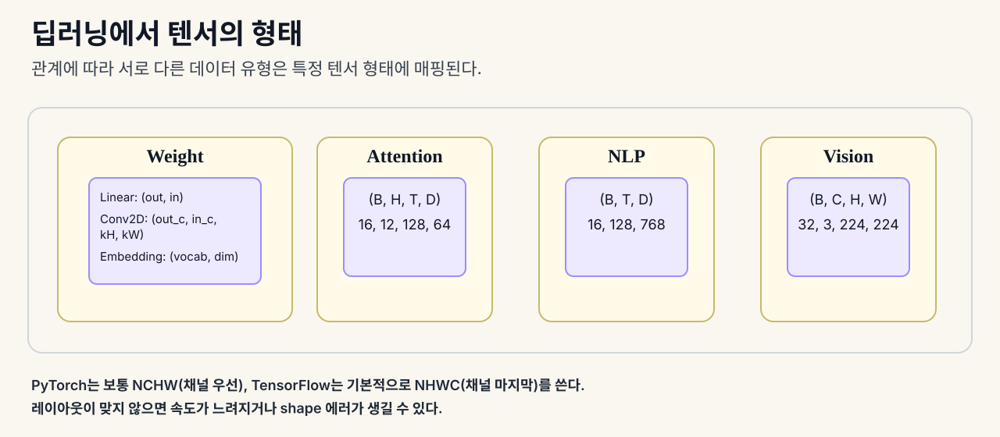

# 텐서 연산

텐서는 데이터와 딥러닝을 이어주는 공통 언어다. 이미지, 문장, 가중치, 그래디언트는 모두 텐서로 표현되고, 신경망 안에서는 텐서 연산으로 흐른다.

## 텐서란 무엇인가

- 텐서는 균일한 데이터 타입을 가진 다차원 숫자 배열이다
- 차원의 수를 rank라고 부른다
- shape는 각 축의 크기를 나타내는 튜플이다
- scalar는 0차원, vector는 1차원, matrix는 2차원, 그 이상은 고차원 텐서다

쉽게 말하면:
- 텐서는 “모양이 있는 숫자 상자”다

## 왜 중요한가

- 딥러닝에서는 이미지, 문장, 배치 데이터가 모두 텐서로 들어온다
- 텐서의 shape를 이해하지 못하면 reshape, transpose, broadcast, attention에서 쉽게 오류가 난다
- 많은 shape 에러는 연산 자체보다 축의 의미를 잘못 이해해서 생긴다

## NumPy와 PyTorch

- NumPy는 텐서 연산을 빠르고 간단하게 해준다
- PyTorch는 여기에 autograd와 GPU 지원이 더해진다
- 두 라이브러리는 shape를 해석하는 방식이 거의 같아서, 기본 개념을 알면 PyTorch 코드도 읽기 쉬워진다

## 텐서 연산과 신경망

- 선형층은 텐서 곱과 broadcast로 표현된다
- attention은 projection, reshape, transpose, einsum으로 구성된다
- batch norm과 softmax도 결국 텐서 연산과 reduction의 조합이다

즉, 딥러닝 모델의 대부분은 텐서 연산으로 이루어져 있다.

## 딥러닝에서 텐서의 형태

- 데이터 종류에 따라 자주 쓰는 텐서 모양이 다르다
- 이미지 입력은 보통 `(B, C, H, W)` 형태다
- NLP 입력은 보통 `(B, T, D)` 형태다
- attention은 보통 `(B, H, T, D)` 형태다
- 선형층, Conv2D, 임베딩도 각자 정해진 shape 규칙을 따른다

쉽게 말하면:
- 데이터 종류마다 “자주 쓰는 모양”이 따로 있다

## 메모리 레이아웃 작동 방식

- 메모리에는 2차원 배열도 결국 1차원 순서로 저장된다
- strides는 한 축으로 한 칸 움직일 때 몇 칸을 건너뛰는지 알려준다
- row-major(C order)와 column-major(F order)는 메모리에 저장되는 순서가 다르다
- transpose는 데이터를 복사하지 않고 strides만 바꾼다
- 그래서 transpose 뒤의 텐서는 비연속(non-contiguous)일 수 있다

## shape와 strides

- shape와 strides는 텐서의 상태를 설명하는 정보다
- shape는 각 축의 크기다
- strides는 한 축으로 한 칸 움직일 때 메모리에서 얼마나 건너뛰는지 알려준다

쉽게 말하면:
- shape는 “크기”
- strides는 “메모리에서 읽는 법”이다

## reshape, squeeze, unsqueeze

- 이들은 텐서의 모양을 바꾸는 조작이다
- reshape는 원소 순서는 유지한 채 모양만 바꾼다
- squeeze는 크기가 1인 축을 없앤다
- unsqueeze는 크기가 1인 축을 하나 넣는다

예를 들어 bias 벡터를 배치 텐서에 더하려면 unsqueeze가 필요할 때가 많다.

## transpose와 permute

- 이들은 축의 배치를 다시 정하는 조작이다
- transpose는 두 축의 위치를 바꾼다
- permute는 모든 축의 순서를 다시 정한다
- 이미지 레이아웃을 바꾸거나 attention의 축을 맞출 때 자주 쓴다

## broadcasting

- broadcasting은 서로 다른 shape를 맞춰서 계산하는 규칙이다
- 오른쪽부터 축을 맞추고, 같거나 1인 차원끼리만 함께 계산할 수 있다
- 작은 텐서를 복사하지 않고 큰 텐서에 자동으로 펼쳐 쓴다

예시:
- `(8, 1, 6, 1)`과 `(7, 1, 5)`는 broadcast 가능하다
- 결과는 `(8, 7, 6, 5)`가 된다

## einsum

- einsum은 축을 문자로 표시해서 텐서 연산을 쓰는 표기법이다
- 같은 문자인데 출력에 없는 축은 합쳐진다
- dot product, matrix multiply, outer product, trace, batch matmul, attention score를 한 줄로 표현할 수 있다

쉽게 말하면:
- einsum은 텐서 연산을 적는 “공식 언어”다

자주 쓰는 형태:
- `i,i->` : 내적
- `i,j->ij` : 외적
- `ij,jk->ik` : 행렬곱
- `ij->ji` : transpose
- `bij,bjk->bik` : 배치 행렬곱
- `bhtd,bhsd->bhts` : attention score
