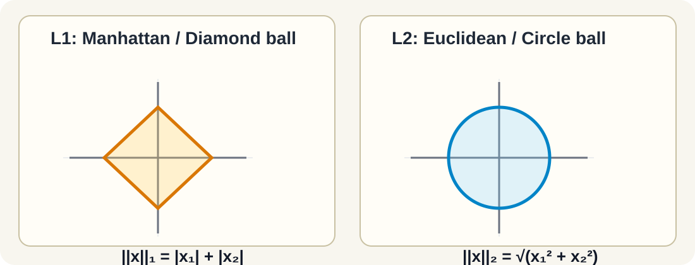
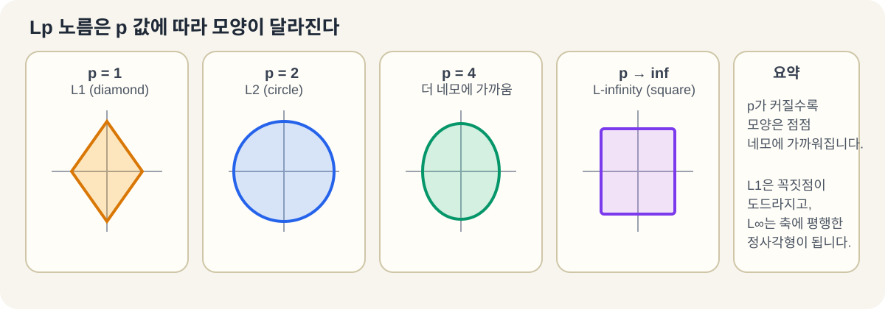
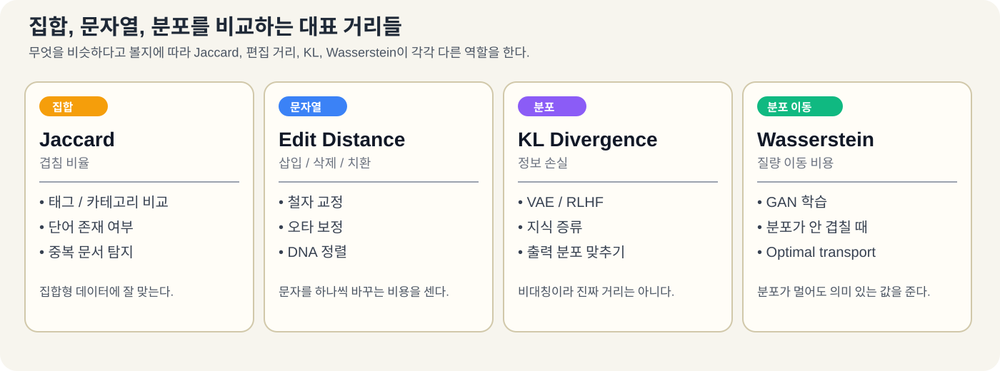
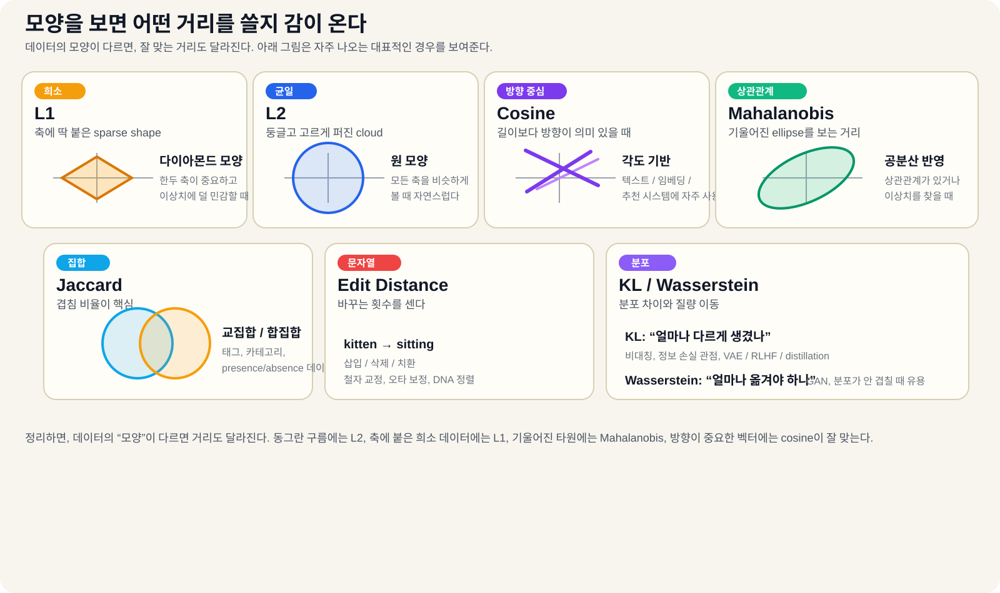

# Norms and Distances

> 거리 함수는 무엇이 비슷한지 정합니다. 이 기준을 잘못 고르면, 뒤의 모델도 엇나갑니다.

## 거리란 무엇인가

벡터나 데이터 두 개 사이의 거리를 재는 방법이 거리 함수입니다. 딥러닝과 머신러닝에서는 이 “가까움”의 정의가 작업마다 다릅니다.

- 텍스트는 길이보다 방향이 중요할 수 있습니다.
- 이미지에서는 픽셀 값의 차이가 중요할 수 있습니다.
- 집합 데이터는 겹치는 원소가 중요한 기준이 됩니다.
- 분포를 비교할 때는 단순한 좌표 차이보다 질량이 어떻게 이동하는지가 더 중요할 수 있습니다.

그래서 하나의 거리로 모든 문제를 풀 수는 없습니다.

## 노름과 거리

노름(norm)은 벡터의 크기를 재는 값입니다. 두 벡터 사이의 거리는 보통 차이 벡터의 노름으로 표현합니다.

```text
d(a, b) = ||a - b||
```

즉, 노름을 이해하면 거리도 이해할 수 있습니다.

## L1 거리 (맨해튼 거리)

L1 노름은 각 성분의 절댓값을 모두 더합니다.

```text
||x||_1 = |x_1| + |x_2| + ... + |x_n|
```

도시의 격자길처럼 가로, 세로로만 이동한다고 생각하면 됩니다. 대각선으로 바로 가지 못하므로 맨해튼 거리라고도 부릅니다.

```text
A = (1, 1)
B = (4, 5)

L1 거리 = |4-1| + |5-1| = 7
```

L1은 이런 경우에 잘 맞습니다.

- 희소한 고차원 데이터
- 이상치에 덜 민감한 문제
- 일부 가중치를 0으로 만들고 싶은 정규화

특징 선택이 필요할 때는 L1 정규화가 도움이 됩니다.
L1 정규화는 일부 가중치를 0으로 만들어 희소성을 만듭니다.

## L2 거리와 유클리드 거리

L2 노름은 우리가 익숙한 직선 거리입니다. (제곱된 성분들의 합의 제곱근)

```text
||x||_2 = sqrt(x_1^2 + x_2^2 + ... + x_n^2)
```

```text
A = (1, 1)
B = (4, 5)

L2 거리 = sqrt((4-1)^2 + (5-1)^2) = 5
```

L2는 다음에 잘 맞습니다.

- 연속형 수치 데이터
- 픽셀처럼 스케일이 비슷한 데이터
- 물리적 거리 감각이 중요한 문제

L2 정규화(Ridge)는 가중치가 너무 커지지 않도록 부드럽게 눌러줍니다. L1과 달리 0으로 딱 떨어뜨리기보다 전체를 부드럽게 줄입니다.



L1과 L2는 노름의 모양 자체가 다릅니다. L1은 네모에 가까운 다이아몬드 모양이고, L2는 둥근 원 모양입니다.

## Lp와 L-infinity 노름 (체비셰프 거리)

L1과 L2는 더 큰 가족인 Lp 노름의 특수한 경우입니다.

```text
||x||_p = (|x_1|^p + |x_2|^p + ... + |x_n|^p)^(1/p)
```

- `p=1`이면 L1
- `p=2`이면 L2
- `p -> inf`이면 L-infinity

L-infinity는 가장 큰 차이 하나만 봅니다.

```text
||x||_inf = max(|x_1|, |x_2|, ..., |x_n|)
```

즉, 어떤 한 축의 최악의 편차가 중요할 때 쓰기 좋습니다.

L-infinity는 다음에 잘 맞습니다.

- 어느 한 차원에서 최악의 편차가 중요할 때
- 게임판처럼 한 번에 한 칸씩 움직이는 문제
- 제조 공차처럼 모든 치수가 규격 범위 안에 들어와야 할 때

체스에서 왕은 L-infinity 거리로 움직인다고 볼 수 있습니다. 어느 방향으로든 한 칸 이동하는 비용이 같기 때문입니다.



Lp 노름은 p가 커질수록 모양이 점점 네모에 가까워집니다. L1은 꼭짓점이 도드라지고, L-infinity는 축에 평행한 정사각형이 됩니다.

## 코사인 유사도와 내적

코사인 유사도는 벡터의 길이보다 두 벡터 사이의 각도를 봅니다.

```text
cos_sim(a, b) = (a . b) / (||a||_2 * ||b||_2)
```

값이 1에 가까우면 같은 방향, 0이면 직교, -1이면 반대 방향입니다.

코사인 유사도는 다음에 특히 잘 맞습니다.

- 텍스트 유사도(TF-IDF 벡터, 단어 임베딩, 문장 임베딩)
- 크기보다 방향이 중요한 모든 영역
- 추천 시스템(사용자 선호도 벡터)
- 임베딩 검색(벡터 데이터베이스에서는 코사인이나 내적을 거의 항상 사용함)

텍스트나 임베딩에서는 길이보다 방향이 의미를 가지는 경우가 많아서 코사인을 자주 씁니다.

내적은 코사인과 비슷하지만 길이 정보도 함께 반영합니다.

```text
a . b = ||a|| * ||b|| * cos(theta)
```

벡터가 이미 정규화되어 있으면 내적과 코사인 유사도는 사실상 같습니다.

실제 적용 사례:

- 순수한 방향 유사도를 원할 때는 코사인 유사도를 사용합니다.
- 크기가 의미 있는 정보를 담고 있을 때는 내적을 사용합니다.
- Pinecone, Weaviate, Qdrant 같은 벡터 데이터베이스에서는 둘 중 하나를 선택할 수 있습니다.
- 임베딩 데이터가 L2 정규화되어 있으면, 어떤 방식을 선택해도 결과가 거의 같습니다.

## 마할라노비스 거리

유클리드 거리는 모든 축을 같은 기준으로 봅니다. 하지만 실제 데이터는 축끼리 서로 연관되어 있을 수 있습니다. 이때는 공분산을 반영한 마할라노비스 거리가 더 자연스럽습니다.

```text
d_M(x, y) = sqrt((x - y)^T S^{-1} (x - y))
```

여기서 `S`는 공분산 행렬입니다.

마할라노비스 거리는 데이터를 먼저 whitening한 뒤 L2를 재는 것과 비슷합니다. 그래서 상관관계가 있는 특징에서 이상치를 찾을 때 유용합니다.

whitening은 데이터의 스케일을 맞추고, 서로 얽힌 축을 풀어주는 전처리입니다.

마할라노비스 거리는 다음에 잘 맞습니다.

- 이상치 탐지(평균으로부터 마할라노비스 거리가 큰 점이 이상치입니다)
- 특징들의 척도와 상관관계가 다를 때의 분류
- 신뢰할 수 있는 공분산 행렬을 추정할 만큼 데이터가 충분할 때
- 제조 공정의 품질 관리(다변량 공정 모니터링)

## 집합, 문자열, 분포

### Jaccard 유사도

집합끼리 얼마나 겹치는지 재는 지표입니다.

```text
J(A, B) = |A ∩ B| / |A ∪ B|
```

태그, 카테고리, 단어 존재 여부처럼 집합형 데이터에 잘 맞습니다.

Jaccard는 다음에 잘 맞습니다.

- 태그나 카테고리의 겹침을 볼 때
- 단어의 등장 여부만 중요하고 등장 횟수는 중요하지 않을 때
- 중복 문서나 거의 같은 집합을 찾을 때

### 편집 거리 (레벤슈타인 거리)

문자열을 다른 문자열로 바꾸는 데 필요한 삽입, 삭제, 치환 횟수를 셉니다. 철자 교정이나 DNA 정렬에 자주 쓰입니다.

편집 거리는 다음에 잘 맞습니다.

- 철자 교정
- 검색어 오타 보정
- DNA 서열 정렬
- 비슷한 문자열을 찾는 fuzzy matching

### KL 발산

KL 발산은 분포가 얼마나 다른지를 재는 값이지만, 진짜 거리는 아닙니다. 대칭이 아니기 때문입니다.

```text
D_KL(P || Q) = sum(p(x) * log(p(x) / q(x)))
```

이 식은 P와 Q의 차이를 보여줍니다. 하지만 KL 발산은 대칭이 아니어서 `D_KL(P || Q) != D_KL(Q || P)`입니다.

분포 비교, VAE, 지식 증류, RLHF에서 자주 등장합니다.

KL 발산은 다음에 잘 맞습니다.

- 확률 분포 자체를 비교할 때
- 모델의 출력 분포를 정답 분포에 맞추고 싶을 때
- VAE의 잠재 분포를 prior에 맞추고 싶을 때
- teacher와 student의 분포 차이를 줄이고 싶을 때

### 바서슈타인 거리 (토공 거리)

한 분포를 다른 분포로 바꾸는 데 필요한 “이동 비용”에 가깝습니다. 분포가 겹치지 않아도 의미 있는 값을 줍니다.

GAN 학습처럼 분포 자체를 비교해야 할 때 특히 유용합니다.

Wasserstein 거리는 다음에 잘 맞습니다.

- 분포가 겹치지 않을 수도 있는 경우
- GAN 학습처럼 분포 비교가 중요한 경우
- 질량이 얼마나 이동하는지가 의미 있는 경우





## 어떤 상황에 어떤 거리를 쓰나

| 문제 | 잘 맞는 거리 | 이유 |
|------|-------------|------|
| 텍스트 유사도 | 코사인 | 길이보다 방향이 중요하다 |
| 픽셀 비교 | L2 | 좌표 차이를 그대로 보는 것이 자연스럽다 |
| 희소한 특징 | L1 | 이상치에 덜 민감하다 |
| 집합 비교 | Jaccard | 겹침 비율이 중요하다 |
| 문자열 비교 | 편집 거리 | 사람이 고치는 방식과 비슷하다 |
| 상관관계 있는 수치 데이터 | 마할라노비스 | 축 간 관계를 반영한다 |
| 확률 분포 비교 | KL / Wasserstein | 분포 자체를 비교한다 |

## 손실과 정규화

많은 손실 함수는 사실 거리의 변형입니다.

- `MSE`는 L2 계열입니다.
- `MAE`는 L1 계열입니다.
- `Cross-entropy`는 분포 차이를 재는 데 가깝습니다.

정규화도 거리와 연결됩니다.

- `L1 정규화`는 희소성을 만듭니다.
- `L2 정규화`는 가중치를 부드럽게 줄입니다.
- `Elastic Net`은 둘을 함께 씁니다.

## 최근접 이웃 탐색

거리 함수를 정하면 곧바로 최근접 이웃 문제로 이어집니다. 가장 가까운 점을 찾는 문제는 벡터 데이터베이스, 추천 시스템, 클러스터링에서 핵심입니다.

데이터가 작으면 정확한 탐색을 할 수 있지만, 커지면 너무 느려집니다. 그래서 HNSW, IVF, LSH 같은 근사 최근접 이웃(ANN) 방법을 씁니다.

즉, 거리 함수는 단순한 수식이 아니라 “무엇을 비슷하다고 볼 것인가”를 정하는 기준입니다. 이 기준이 바뀌면 이웃, 손실, 정규화가 모두 달라집니다.
