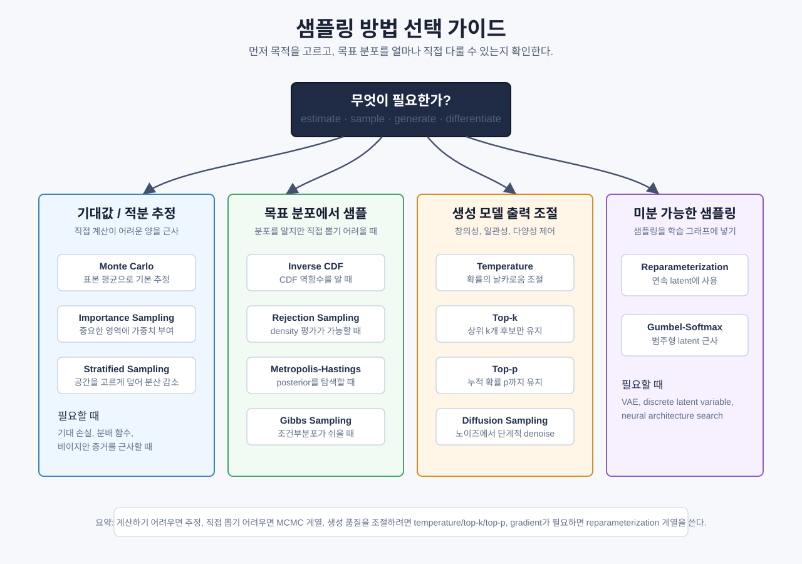

# 샘플링 방법

> 샘플링은 가능한 세계들 중 하나를 고르는 방법이다. 생성형 AI는 결국 이 선택을 반복한다.

## 샘플링이란 무엇인가

샘플링은 어떤 분포에서 하나의 값을 뽑는 일이다. 딥러닝에서는 생성, 추정, 탐색, 학습의 네 곳에서 반복해서 등장한다.

- 생성: 언어 모델, 확산 모델, GAN은 샘플링으로 출력을 만들고 temperature, top-k, top-p로 창의성·일관성·다양성을 조절한다.
- 추정: 기대 손실, 분배 함수, 베이지안 증거처럼 직접 계산하기 어려운 양을 표본 평균으로 근사한다.
- 탐색: MCMC, 진화 전략, Thompson sampling은 샘플링으로 posterior, parameter space, bandit 선택지를 탐색한다.
- 학습: mini-batch, dropout, data augmentation처럼 무작위성을 쓴다.

샘플링의 핵심은 단순한 분포에서 복잡한 분포를 만드는 것이다. 보통은 `Uniform(0, 1)` 같은 아주 단순한 난수에서 시작한다.

## 균일 무작위 샘플링

균일 분포는 모든 구간이 같은 확률을 갖는 가장 기본적인 분포이다.

```text
U ~ Uniform(0, 1)
P(a <= U <= b) = b - a
E[U] = 0.5
Var(U) = 1/12
```

이 하나의 난수로 이산 집합, 구간, 다른 분포의 샘플을 만들 수 있다. 나머지 샘플링 기법은 결국 이 난수를 어떻게 바꾸느냐의 문제다.

## 역 누적 분포 함수(CDF) 방법

누적분포함수(CDF)는 값이 아니라 확률까지 누적한 함수다.

```text
F(x) = P(X <= x)
```

만약 역함수 `F^{-1}`를 구할 수 있으면, `U ~ Uniform(0, 1)`에 대해 `X = F^{-1}(U)`는 목표 분포를 따른다.

```text
Algorithm:
1. u ~ Uniform(0, 1)을 뽑는다.
2. x = F^{-1}(u)를 반환한다.
```

지수분포는 이 방법이 잘 된다.

```text
f(x) = lambda * exp(-lambda * x)
F(x) = 1 - exp(-lambda * x)
X = -log(U) / lambda
```

이산 분포에서는 CDF를 누적합으로 만들고, U가 처음 넘어서는 위치를 찾으면 된다.

## 거부 샘플링 (Rejection Sampling)

역 CDF를 못 쓰더라도, 목표 분포를 상수배까지 평가할 수 있으면 rejection sampling을 쓸 수 있다.

```text
Target: p(x)
Proposal: q(x)
M such that p(x) <= M q(x)

1. x ~ q(x)
2. u ~ Uniform(0, 1)
3. u < p(x) / (M q(x)) 이면 accept
4. 아니면 reject
```

수용률은 대략 `1/M`이다. 제안분포가 목표분포와 비슷할수록 효율이 좋다. 고차원에서는 잘 안 된다. 대부분의 후보가 버려지기 때문이다.

## 중요도 샘플링 (Importance Sampling)

우리가 원하는 것은 샘플 자체가 아니라 기대값일 때가 많다.

```text
E_p[f(x)] = integral f(x) p(x) dx
          = E_q[f(x) * p(x)/q(x)]
```

여기서 `w(x) = p(x) / q(x)`가 importance weight이다.

```text
E_p[f(x)] ~= (1/N) * sum(f(x_i) * w(x_i))
```

`q`가 `p`와 너무 다르면 일부 샘플의 가중치가 커져 분산이 폭발한다. 그래서 self-normalized importance sampling을 쓰기도 한다.

```text
sum(w_i * f(x_i)) / sum(w_i)
```

## Monte Carlo 추정

몬테카를로는 무작위 샘플의 평균으로 적분을 근사하는 방법이다.

```text
I = integral_D g(x) dx
I ~= (Vol(D) / N) * sum(g(x_i))
```

오차는 보통 `O(1 / sqrt(N))`이다. 차원이 커져도 이 속도는 크게 변하지 않는다. 그래서 고차원 적분에서 자주 쓰인다.

기댓값도 같은 방식으로 근사한다.

```text
E[f(X)] ~= (1/N) * sum(f(x_i))
```

## MCMC: Metropolis-Hastings

목표 분포에서 직접 샘플링할 수 없을 때, 목표 분포를 stationary distribution으로 갖는 마코프 체인을 만든다.

```text
alpha = [p(x') q(x|x')] / [p(x) q(x'|x)]
```

제안된 점 `x'`를 확률 `min(1, alpha)`로 받아들인다. 대칭 제안이면 `alpha = p(x') / p(x)`로 단순해진다.

- burn-in: 초반 샘플을 버린다.
- thinning: 상관이 큰 샘플을 건너뛴다.
- proposal scale: 너무 작으면 천천히 움직이고, 너무 크면 거의 거절된다.

## Gibbs Sampling

Gibbs sampling은 각 변수를 한 번에 하나씩 조건부분포에서 다시 뽑는다.

```text
x_1 ~ p(x_1 | x_2, ..., x_d)
x_2 ~ p(x_2 | x_1, x_3, ..., x_d)
...
```

각 조건부분포를 직접 샘플링할 수 있으면 구현이 쉽다. 하지만 변수들이 강하게 얽혀 있으면 이동이 느리다.

## 온도 샘플링 (Temperature Sampling)

언어 모델은 토큰마다 logits를 만든다. temperature는 softmax 전에 logits를 나누는 값이다.

```text
p_i = exp(z_i / T) / sum(exp(z_j / T))
```

- `T -> 0`: 가장 높은 점수만 고른다.
- `T = 1`: 기본 softmax다.
- `T > 1`: 분포가 평평해진다.

temperature는 가능한 토큰을 바꾸는 게 아니라, 각 토큰에 주는 확률의 날카로움을 바꾼다.

## Top-k Sampling

Top-k는 확률이 가장 높은 k개 토큰만 남기고 나머지를 버린다.

```text
1. softmax를 계산한다.
2. 상위 k개만 남긴다.
3. 다시 정규화한다.
```

- `k = 1`이면 greedy decoding이다.
- `k = V`이면 필터링이 없다.

단점은 상황을 보지 않고 항상 같은 k를 쓴다는 점이다.

## Top-p Sampling

Top-p(nucleus sampling)는 누적 확률이 `p`를 넘는 최소 집합만 남긴다.

```text
1. 확률순으로 정렬한다.
2. 누적합이 p를 넘는 최소 k를 찾는다.
3. 그 집합만 남기고 다시 정규화한다.
```

모델이 확신할 때는 후보가 적고, 불확실할 때는 후보가 많다. 그래서 top-k보다 자연스러운 경우가 많다.

## 재매개변수화 기법 (Reparameterization Trick)

VAE에서는 샘플링을 거쳐도 gradient가 흘러야 한다. 그런데 샘플링 연산 자체는 미분이 어렵다.

```text
z ~ N(mu, sigma^2)
```

이를 다음처럼 바꾼다.

```text
epsilon ~ N(0, 1)
z = mu + sigma * epsilon
```

이제 randomness는 `epsilon`에 있고, `mu`와 `sigma`는 미분 가능한 식 안에 있다. 그래서 backpropagation이 가능하다.

## Gumbel-Softmax

범주형 샘플링도 미분 가능하게 만들고 싶을 때 쓴다.

```text
g_i = -log(-log(u_i)),   u_i ~ Uniform(0, 1)
```

Gumbel-Max는 정확한 categorical sampling을 준다.

```text
argmax(log(p_i) + g_i)
```

Gumbel-Softmax는 argmax 대신 softmax를 써서 연속적인 근사를 만든다. discrete latent variable을 다루는 VAE나 neural architecture search에 쓰인다.

## 층화 표본 추출 (Stratified Sampling)

샘플 공간을 strata로 나누고 각 구간에서 하나씩 뽑는다.

```text
x_i = (i + u_i) / N,   u_i ~ Uniform(0, 1)
```

일반 Monte Carlo보다 분산이 작다. 공간을 골고루 채우기 때문이다.

## 확산 모델 (Diffusion Models)

Diffusion model은 노이즈를 더하는 forward process와, 노이즈를 빼는 reverse process로 샘플을 만든다.

```text
x_t = sqrt(alpha_t) * x_{t-1} + sqrt(1 - alpha_t) * epsilon
```

각 단계는 샘플링 단계다. 시작은 순수한 노이즈이고, 끝은 이미지나 오디오 같은 구조화된 샘플이다.

## 샘플링 방법 한눈에 보기

샘플링 방법은 "무엇을 뽑고 싶은가"와 "목표 분포를 얼마나 알고 있는가"에 따라 달라진다.

| 방법 | 핵심 아이디어 | 필요할 때 | 장점 | 주의할 점 |
|---|---|---|---|---|
| 균일 무작위 샘플링 | 모든 값에 같은 확률을 준다 | 가장 기본 난수, 다른 샘플러의 출발점 | 단순하고 빠름 | 목표 분포가 균일하지 않으면 그대로는 부족 |
| 역 CDF | 균일 난수를 CDF의 역함수에 넣는다 | CDF 역함수를 알 수 있는 분포 | 정확하고 구현이 깔끔함 | 역함수를 구하기 어려우면 못 씀 |
| Rejection Sampling | 쉬운 제안분포에서 뽑고 일부만 accept | 목표 density는 계산 가능하지만 직접 샘플링은 어려울 때 | 직관적이고 정확한 샘플 가능 | 고차원에서는 대부분 reject되어 비효율적 |
| Importance Sampling | 다른 분포에서 뽑고 가중치로 보정 | 샘플 자체보다 기대값을 추정하고 싶을 때 | 드문 사건이나 특정 영역 추정에 유리 | 가중치 분산이 크면 추정이 불안정 |
| Monte Carlo | 많은 샘플의 평균으로 적분/기대값 근사 | 직접 계산하기 어려운 기대값, 적분, 손실 추정 | 차원이 커져도 기본 오차율이 단순함 | 오차가 `1/sqrt(N)`이라 정밀도를 높이려면 샘플이 많이 필요 |
| Metropolis-Hastings | proposal을 만들고 확률적으로 accept/reject | 정규화 상수를 모르는 posterior에서 샘플링할 때 | 비정규화 density만 알아도 됨 | burn-in, mixing, proposal scale 조정 필요 |
| Gibbs Sampling | 변수를 하나씩 조건부분포에서 다시 뽑는다 | 조건부분포는 쉬운데 joint distribution은 어려울 때 | 다변수 Bayesian model에 유용 | 변수들이 강하게 얽혀 있으면 느리게 움직임 |
| Temperature Sampling | logits를 temperature로 나눠 확률의 날카로움 조절 | LLM 출력의 창의성/안정성을 조절할 때 | 한 값으로 다양성 조절 가능 | 너무 낮으면 뻔하고, 너무 높으면 산만함 |
| Top-k Sampling | 확률 상위 `k`개 후보만 남긴다 | 낮은 확률의 이상한 token을 제거하고 싶을 때 | 간단하고 예측 가능 | 상황과 무관하게 후보 수가 고정됨 |
| Top-p Sampling | 누적 확률 `p`까지의 후보만 남긴다 | 확신할 때는 좁게, 불확실할 때는 넓게 뽑고 싶을 때 | top-k보다 적응적 | `p`가 너무 낮으면 표현이 빈약해질 수 있음 |
| Reparameterization Trick | randomness를 별도 noise 변수로 분리한다 | VAE처럼 샘플링을 지나 gradient가 흘러야 할 때 | backpropagation 가능 | 모든 분포에 쉽게 적용되지는 않음 |
| Gumbel-Softmax | categorical sample을 softmax로 연속 근사한다 | discrete latent variable을 미분 가능하게 다룰 때 | 범주형 선택을 학습에 넣을 수 있음 | temperature가 낮을수록 gradient가 불안정할 수 있음 |
| 층화 표본 추출 | 공간을 구간으로 나누고 각 구간에서 뽑는다 | 샘플 공간을 고르게 덮고 분산을 줄이고 싶을 때 | Monte Carlo보다 안정적인 추정 | strata를 잘 나누는 설계가 필요 |
| Diffusion Sampling | 노이즈에서 시작해 단계적으로 denoise한다 | 이미지, 오디오, 비디오 같은 생성 모델 | 고품질 생성에 강함 | 여러 denoising step 때문에 느릴 수 있음 |


