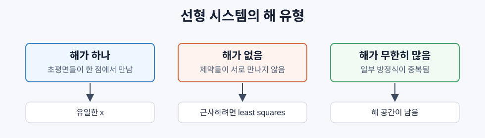

# 선형 시스템

> `Ax = b`는 선형회귀, 가우시안 프로세스, 공분산 역행렬, 릿지 회귀 안쪽에서 계속 반복되는 기본 문제다.

## 선형 시스템이란 무엇인가

선형 시스템은 알려진 행렬 `A`와 벡터 `b`가 있을 때, 다음을 만족하는 미지수 `x`를 찾는 문제다.

```text
Ax = b
```

기하학적으로 각 방정식은 선, 평면, 초평면을 만든다. 해는 이 초평면들이 만나는 지점이다.



ML에서는 데이터가 방정식보다 많아 정확히 맞는 해가 없는 경우가 많다. 그래서 `Ax = b`를 정확히 푸는 대신, `Ax`가 `b`에 가장 가까워지도록 푼다. 이것이 최소제곱법이다.

## 행 관점과 열 관점

`Ax = b`는 두 방식으로 볼 수 있다.

- 행 관점: `A`의 각 행이 하나의 방정식이다.
- 열 관점: `A`의 각 열을 조합해서 `b`를 만들 수 있는지 묻는다.

```text
A = | 2  1 |, b = | 5 |
    | 1 -1 |      | 1 |

x1 * [2, 1] + x2 * [1, -1] = [5, 1]
```

`b`가 `A`의 열공간 안에 있으면 정확한 해가 있다. 없으면 열공간 안에서 `b`와 가장 가까운 점을 찾는다.

## 가우스 소거법 (Gaussian Elimination)

가우스 소거법은 `Ax = b`를 위삼각 시스템 `Ux = c`로 바꾼 뒤, 아래에서 위로 역대입한다.

```text
1. 피벗 열을 고른다.
2. 피벗 아래의 값들을 0으로 만든다.
3. 마지막 행부터 x를 계산한다.
```

핵심 연산은 한 행에서 다른 행의 배수를 빼는 것이다.

```text
R_i <- R_i - m * R_k
m = A[i][k] / A[k][k]
```

계산량은 `O(n^3)`이다. 한 번 푸는 정방행렬 시스템에는 직접적이고 좋은 방법이지만, 같은 `A`에 대해 여러 `b`를 풀 때는 분해법이 더 유리하다.

## 부분 피벗팅 (Partial Pivoting)

피벗이 0이면 나눌 수 없고, 피벗이 매우 작으면 반올림 오차가 커진다. 그래서 각 열에서 절댓값이 가장 큰 행을 피벗 행으로 올린다.

```text
나쁜 피벗: 0.001로 나누면 배수가 1000처럼 커진다.
좋은 피벗: 1.0으로 나누면 배수가 작아져 오차가 덜 증폭된다.
```

부분 피벗팅은 단순한 행 교환이지만, 실제 부동소수점 계산에서는 해의 신뢰도를 크게 바꾼다.

## LU 분해 (LU Decomposition)

LU 분해는 행렬을 하삼각행렬 `L`과 상삼각행렬 `U`로 분해한다.

```text
A = LU
PA = LU    # 피벗팅이 있으면 순열 행렬 P가 붙는다.
```

한 번 분해하면 같은 `A`에 대해 여러 `b`를 빠르게 풀 수 있다.

```text
Ax = b
LUx = b
Ly = b      # 전진대입
Ux = y      # 역대입
```

분해는 `O(n^3)`이지만, 이후 각 풀이 단계는 `O(n^2)`이다.

## QR 분해 (QR Decomposition)

QR 분해는 A를 직교 행렬 Q와 상삼각 행렬 R(`A = QR`)로 분해한다.

```text
Q^T Q = I
R은 상삼각 행렬
```

`Q`는 길이와 각도를 보존하는 직교 행렬이다. 최소제곱 문제를 풀 때는 정규방정식을 직접 푸는 것보다 QR을 쓰는 편이 수치적으로 더 안정적이다.

```text
Ax = b
QRx = b
Rx = Q^T b
```

Gram-Schmidt는 각 열에서 이전 기저 방향의 성분을 빼고 길이를 1로 맞춰서 서로 직교하고 길이가 1인 기저를 만든다.

## Cholesky 분해

`A`가 대칭 양정치 행렬이면 다음처럼 쓸 수 있다.

```text
A = L L^T
```

Cholesky는 LU보다 빠르고 저장공간도 적게 쓴다. 조건이 까다롭지만 머신러닝에서 자주 나온다.

- 공분산 행렬
- 가우시안 프로세스의 커널 행렬
- 릿지 회귀의 `X^T X + lambda I`
- 볼록 최솟값 근처의 양의 정부호 헤세 행렬

가우시안 프로세스에서는 `K alpha = y`를 풀고, 로그 행렬식도 다음처럼 계산한다.

```text
log det(K) = 2 * sum(log(diag(L)))
```

## 최소제곱법과 정규방정식

데이터가 많으면 보통 `m > n`인 과잉결정 시스템이 된다. 모든 식을 만족하는 `x`가 없으므로 잔차를 최소화한다.

```text
최소화 ||Ax - b||^2
```

미분해서 0으로 두면 정규방정식이 나온다.

```text
A^T A x = A^T b
x = (A^T A)^(-1) A^T b
```

이 식이 선형회귀의 닫힌형 해다.

```text
X^T X w = X^T y
```

릿지 회귀는 여기에 정규화를 더한다.

```text
(X^T X + lambda I) w = X^T y
```

`lambda I`는 과적합을 줄일 뿐 아니라 행렬의 조건도 더 좋게 만든다.

## 유사역행렬

Moore-Penrose 의사역행렬은 정방행렬이 아니거나 특이한 행렬에도 역행렬과 비슷한 역할을 한다.

```text
A = U Sigma V^T
A+ = V Sigma+ U^T
x = A+ b
```

의미는 상황마다 다르다.

| 상황 | `A+ b`의 의미 |
|---|---|
| 해가 하나 | 그 정확한 해 |
| 해가 없음 | 최소제곱 해 |
| 해가 무한히 많음 | 노름이 가장 작은 해 |

`np.linalg.lstsq`, `np.linalg.pinv`는 보통 SVD 기반으로 이런 문제를 안정적으로 푼다.

## 조건 번호

조건수는 입력의 작은 변화가 해에 얼마나 크게 증폭되는지 나타낸다.

```text
kappa(A) = ||A|| * ||A^(-1)||
         = sigma_max / sigma_min
```

```text
kappa ~ 1       안정적
kappa ~ 10^k    대략 k자리 정밀도 손실
kappa ~ 10^16   float64에서는 사실상 특이 행렬
```

머신러닝에서 조건이 나쁜 행렬은 특징 공선성 때문에 자주 생긴다. 두 특징이 거의 같은 정보를 담으면 `X^T X`의 작은 특잇값이 매우 작아진다. 릿지 회귀는 다음처럼 조건수를 완화한다.

```text
sigma_max / sigma_min
-> (sigma_max + lambda) / (sigma_min + lambda)
```

## 반복법: 켤레기울기법

큰 희소 시스템에서는 LU나 Cholesky를 직접 하기 어렵다. 켤레기울기법은 대칭 양의 정부호 행렬에 대해 반복적으로 해를 개선한다.

```text
r = b - Ax          # 잔차
p = r              # 탐색 방향

반복:
  alpha = (r.r) / (p.A.p)
  x <- x + alpha p
  r_new <- r - alpha A p
  beta = (r_new.r_new) / (r.r)
  p <- r_new + beta p
```

정확한 산술에서는 최대 `n`번 안에 수렴하지만, 실제로는 조건수가 좋으면 훨씬 빨리 수렴한다.

## 어떤 방법을 언제 쓰는가

| 방법 | 조건 | 장점 | 주 사용처 |
|---|---|---|---|
| 가우스 소거법 | 정방행렬, 비특이 | 직접적 | 작은 일회성 풀이 |
| LU | 정방행렬 | 같은 `A` 재사용 | 여러 우변 |
| QR | 직사각 행렬 가능 | 최소제곱에 안정적 | 선형회귀 |
| Cholesky | 대칭 양의 정부호 | 빠르고 메모리 절약 | 공분산, 커널, 릿지 |
| 정규방정식 | 과잉결정 | 식이 간단 | 작은 선형회귀 |
| SVD/의사역행렬 | 거의 모든 `A` | 랭크가 부족한 경우에 강함 | 불안정한 최소제곱 |
| 켤레기울기법 | 희소 SPD | 큰 행렬 가능 | 대규모 최적화 |

## 머신러닝에서 왜 중요한가

선형 시스템은 모델의 바깥이 아니라 안쪽에 있다.

- 선형회귀: `X^T X w = X^T y`
- 릿지 회귀: `(X^T X + lambda I) w = X^T y`
- 가우시안 프로세스: `K alpha = y`
- 마할라노비스 거리: 공분산 역행렬 또는 선형 시스템 풀이
- 직교 초기화: QR 분해
- 대규모 뉴턴 방법: 켤레기울기법

중요한 감각은 "역행렬을 직접 구한다"가 아니라 "선형 시스템을 푼다"이다. 수치적으로는 `A^{-1}b`보다 `solve(A, b)`가 안정적이다.