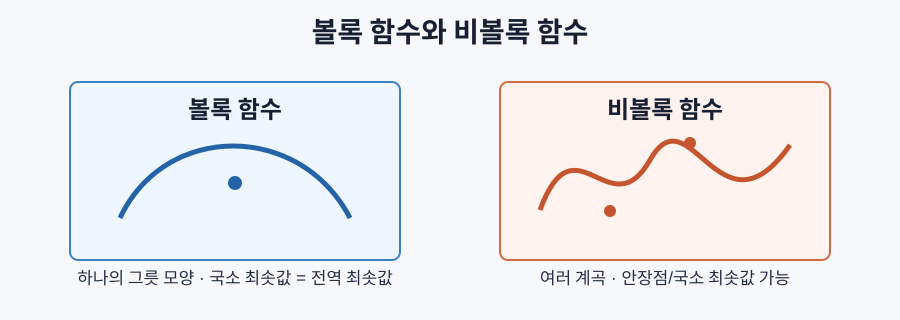
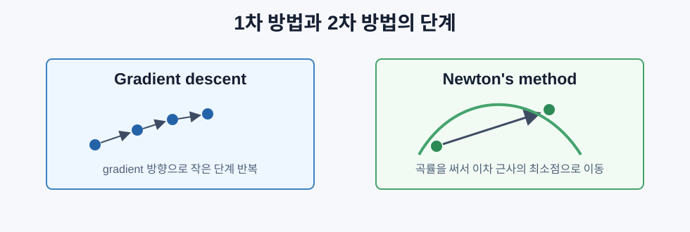

# 볼록 최적화

> 볼록 문제에는 하나의 계곡만 있다. 신경망에는 수많은 계곡과 안장점이 있다. 이 차이를 아는 것이 최적화 감각의 출발점이다.

## 볼록성이 왜 중요한가

경사하강법, momentum, Adam은 어디든 내려갈 수 있지만, 항상 좋은 곳에 도착한다는 보장은 없다. 비볼록 함수에서는 국소 최솟값, 안장점, 진동이 모두 가능하다.

하지만 문제가 볼록하면, 어디에서 시작해도 내려가는 방향을 잘 따라가면 가장 좋은 해에 도달한다고 말할 수 있다.

```text
볼록 함수의 모든 국소 최솟값은 전역 최솟값이다.
```

그래서 선형회귀, 로지스틱 회귀, SVM, LASSO, 릿지 회귀처럼 볼록한 머신러닝 문제에서는 해의 품질을 수학적으로 보장할 수 있다.

## 볼록 집합

집합 `S`가 볼록하다는 것은 `S` 안의 두 점을 잇는 선분이 전부 `S` 안에 있다는 뜻이다.

```text
for any x, y in S and t in [0, 1]:
  t x + (1 - t) y 도 S 안에 있음
```

| 볼록 | 비볼록 |
|---|---|
| 선, 평면, 전체 공간 | 구멍 있는 도넛 모양 |
| 공, 구 | 서로 떨어진 두 원의 합집합 |
| 반공간 `{x : a^T x <= b}` | 안쪽으로 파인 도형 |
| 볼록 집합들의 교집합 | 일부 선분이 밖으로 나가는 집합 |

제약조건이 볼록 집합을 만들면 최적화가 훨씬 다루기 쉬워진다.

## 볼록 함수

함수 `f`가 볼록하다는 것은 두 점 사이의 함수값이 직선 보간값보다 아래에 있다는 뜻이다.

```text
f(t x + (1 - t) y) <= t f(x) + (1 - t) f(y)
```

기하학적으로는 그래프 위의 두 점을 잇는 선분이 함수 그래프 위쪽에 놓인다.



대표적인 볼록 함수는 `x^2`, `|x|`, `e^x`, `max(0, x)`, `-log(x)`이다. 선형 함수는 볼록이면서 오목이다.

## 볼록성 테스트

가장 자주 쓰는 기준은 세 가지다.

| 테스트 | 조건 | 사용 상황 |
|---|---|---|
| 정의 | `f(tx+(1-t)y) <= tf(x)+(1-t)f(y)` | 직접 샘플링해서 확인 |
| 1차원 2계 도함수 | `f''(x) >= 0` | 일변수 함수 |
| 헤시안 행렬 | `H(x)`가 양의 준정부호 | 다변수 함수 |

헤시안 행렬은 모든 2차 편미분을 담은 행렬이다.

```text
H[i][j] = d^2 f / (dx_i dx_j)
```

헤시안 행렬의 고유값은 곡률을 말한다.

```text
모두 양수      위로 휜 곡률, 국소 최솟값
모두 음수      아래로 휜 곡률, 국소 최댓값
부호가 섞임    안장점
모두 0 이상    볼록성 후보
```

볼록성을 보이려면 한 점이 아니라 정의역 전체에서 헤시안 행렬이 양의 준정부호여야 한다.

## 볼록과 비볼록 머신러닝 문제

| 문제 | 볼록한가? | 이유 |
|---|---:|---|
| 선형회귀 | 예 | 가중치에 대해 2차 손실 |
| 로지스틱 회귀 | 예 | 로그 손실이 가중치에 대해 볼록 |
| SVM | 예 | 힌지 손실과 볼록 제약조건 |
| LASSO | 예 | 볼록 손실 + L1 노름 |
| 릿지 회귀 | 예 | 볼록 손실 + L2 노름 |
| 신경망 | 아니오 | 비선형 은닉층이 손실 지형을 복잡하게 만듦 |
| k-means | 아니오 | 이산적인 할당 단계 |
| 행렬 분해 | 아니오 | 미지수끼리 곱해짐 |

선형 모델에 볼록 손실을 쓰면 보통 볼록하다. 은닉층과 비선형 활성화가 들어가면 대부분 비볼록이 된다.

## Newton 방법

경사하강법은 1차 정보인 기울기만 쓴다. Newton 방법은 2차 정보인 헤시안 행렬까지 사용한다.

```text
x_new = x - H^(-1) gradient
```

경사하강법의 학습률이 하나의 숫자라면, Newton 방법의 `H^(-1)`는 방향별 곡률을 반영하는 행렬 형태의 학습률처럼 작동한다.



장점은 빠른 수렴과 학습률을 따로 정하지 않아도 된다는 점이다. 단점은 헤시안 행렬 계산과 역행렬 계산이 너무 비싸다는 점이다.

```text
헤시안 행렬 메모리: O(n^2)
헤시안 행렬 역행렬: O(n^3)
```

백만 개 매개변수를 가진 신경망에서는 현실적이지 않다.

## 제약 조건 최적화

현실의 최적화는 대부분 제약이 있다.

```text
최소화 f(x)
제약조건 g(x) = 0
```

라그랑주 승수는 제약이 있는 문제를 다음 라그랑지안으로 바꾼다.

```text
L(x, lambda) = f(x) + lambda g(x)
```

최적점에서는 다음이 성립한다.

```text
gradient_x L = 0
g(x) = 0
```

기하학적으로는 목적함수의 기울기와 제약식의 기울기가 평행해지는 지점이다. 제약면을 따라 조금 움직여도 더 내려갈 방향이 없기 때문이다.

## KKT 조건

KKT 조건은 부등식 제약조건까지 다루는 라그랑주 승수의 확장이다.

```text
최소화 f(x)
제약조건 g_i(x) <= 0
```

필요 조건은 다음 네 가지다.

```text
1. 정지 조건:
   gradient f + sum(lambda_i gradient g_i) = 0

2. 원문제 가능성:
   g_i(x) <= 0

3. 쌍대 가능성:
   lambda_i >= 0

4. 상보 여유성:
   lambda_i * g_i(x) = 0
```

상보 여유성이 핵심이다. 어떤 제약은 활성화되어 경계에 걸리고, 어떤 제약은 해에 영향을 주지 않아 승수가 0이 된다.

SVM에서 서포트 벡터는 바로 활성 제약조건을 가진 데이터 점이다. `lambda > 0`인 점만 결정 경계를 정한다.

## 정규화는 제약조건이다

L2와 L1 정규화는 단순한 벌점 기법이 아니라 제약 최적화의 다른 표현이다.

```text
Ridge:
Loss(w) 최소화, 제약조건 ||w||^2 <= t
<=> Loss(w) + lambda ||w||^2 최소화

LASSO:
Loss(w) 최소화, 제약조건 ||w||_1 <= t
<=> Loss(w) + lambda ||w||_1 최소화
```

| 정규화 | 제약 모양 | 효과 |
|---|---|---|
| L2 | 원/구 | 가중치를 작게 줄임 |
| L1 | 다이아몬드 | 일부 가중치가 정확히 0, 희소함 |

L1이 희소한 이유는 다이아몬드의 꼭짓점이 축에 놓이기 때문이다. 손실 등고선이 꼭짓점에서 닿을 확률이 높고, 그러면 어떤 좌표가 0이 된다.

## 이중성

원문제에는 대응되는 쌍대 문제가 있다.

```text
원문제: f(x) 최소화, 제약조건 g(x) <= 0
라그랑지안: L(x, lambda) = f(x) + lambda g(x)
쌍대 함수: d(lambda) = min_x L(x, lambda)
쌍대 문제: d(lambda) 최대화, 제약조건 lambda >= 0
```

볼록 문제에서는 조건이 맞으면 원문제와 쌍대 문제의 최적값이 같다. 이를 강한 이중성이라고 한다.

SVM은 쌍대 형태에서 내적만 남는다.

```text
x_i^T x_j -> K(x_i, x_j)
```

이 치환이 커널 트릭이다. 원래 특징 공간을 명시적으로 만들지 않고도 고차원 분류를 할 수 있다.

## 딥러닝은 왜 비볼록인데도 되는가

신경망 손실 지형은 비볼록이지만, 실제로 SGD는 자주 좋은 해를 찾는다. 이유는 몇 가지다.

- 고차원에서는 나쁜 국소 최솟값보다 안장점이 훨씬 많다.
- 많은 국소 최솟값이 전역 최솟값과 비슷한 손실을 갖는다.
- 과매개변수화는 계곡들을 더 넓고 연결되게 만든다.
- 미니배치 잡음은 뾰족한 최솟값보다 평평한 최솟값으로 가는 경향을 만든다.

```text
뾰족한 최솟값: 학습 데이터에는 좋지만 일반화가 약할 수 있음
평평한 최솟값: 주변이 넓게 낮아서 일반화가 좋을 가능성이 큼
```

SGD의 잡음은 단순한 방해가 아니라 암묵적 정규화처럼 작동한다.

## 실제 2차 방법

완전한 Newton 방법은 너무 비싸서 실제로는 근사 방법을 쓴다.

| 방법 | 아이디어 | 메모리 |
|---|---|---|
| L-BFGS | 최근 기울기 변화로 역헤시안 행렬 근사 | `O(mn)` |
| Natural gradient | Fisher information으로 확률분포의 기하 반영 | 큼 |
| K-FAC | Fisher를 Kronecker product로 근사 | 층 단위 |
| Hessian-free | 헤시안 행렬을 만들지 않고 헤시안-벡터 곱 사용 | 낮음 |
| Adam | 2차 모멘트를 대각 곡률처럼 사용 | `O(n)` |
