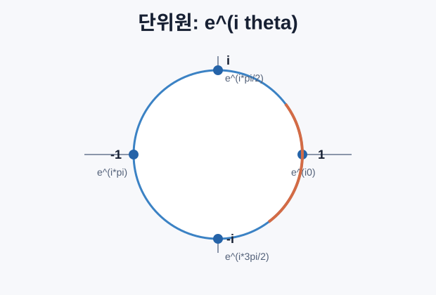
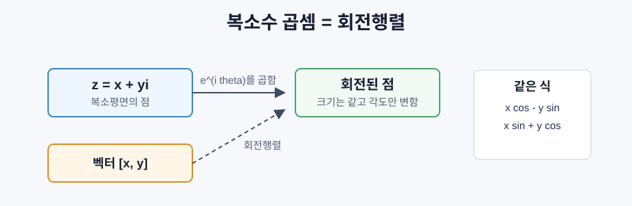

# 인공지능을 위한 복소수

> `i`는 상상이 아니라 회전이다. 푸리에 변환, 페이저, 위치 인코딩을 이해하려면 복소수의 기하학이 필요하다.

## 복소수란 무엇인가

복소수는 실수부와 허수부를 가진 수다.

```text
z = a + bi
i^2 = -1
```

실수축과 허수축을 가진 평면 위의 한 점으로 볼 수 있다.

```text
3 + 2i  -> 점 (3, 2)
-1 + 0i -> 실수축
0 + 4i  -> 허수축
```

즉 복소수는 숫자이면서, 원점에서 그 점으로 향하는 2D 벡터이기도 하다.

## 기본 연산

덧셈은 성분별 벡터 덧셈이다.

```text
(a + bi) + (c + di) = (a + c) + (b + d)i
```

곱셈은 분배법칙과 `i^2 = -1`을 이용한다.

```text
(a + bi)(c + di)
= (ac - bd) + (ad + bc)i
```

켤레복소수는 허수부의 부호를 바꾼다.

```text
conj(a + bi) = a - bi
(a + bi)(a - bi) = a^2 + b^2
```

나눗셈은 분모의 켤레복소수를 곱해서 분모를 실수로 만든다.

```text
(a + bi) / (c + di)
= (a + bi)(c - di) / (c^2 + d^2)
```

## 극형식

복소수는 좌표 `(a, b)` 대신 거리와 각도로도 표현할 수 있다.

```text
z = r (cos theta + i sin theta)
r = |z| = sqrt(a^2 + b^2)
theta = atan2(b, a)
```

직교형식은 덧셈에 좋고, 극형식은 곱셈에 좋다.

```text
z1 = r1 e^(i theta1)
z2 = r2 e^(i theta2)

z1 z2 = r1 r2 e^(i(theta1 + theta2))
```

곱하면 크기는 곱해지고 각도는 더해진다. 그래서 복소수 곱셈은 "스케일 조정 + 회전"이다.

## 오일러(Euler)의 공식

복소수에서 가장 중요한 공식은 Euler 공식이다.

```text
e^(i theta) = cos(theta) + i sin(theta)
```

`theta`가 변하면 `e^(i theta)`는 단위원 위를 돈다.

```text
theta = 0        -> 1
theta = pi/2     -> i
theta = pi       -> -1
theta = 3pi/2    -> -i
theta = 2pi      -> 1
```



특히 `theta = pi`일 때:

```text
e^(i pi) + 1 = 0
```

## `i`는 90도 회전이다

`i`를 곱하는 것은 90도 회전이다.

```text
1 * i = i              # 90도
i * i = -1             # 180도
(-1) * i = -i          # 270도
(-i) * i = 1           # 360도
```

그래서 `i^2 = -1`은 이상한 규칙이 아니라, 90도 회전을 두 번 하면 반대 방향이 된다는 뜻이다.

## 2D 회전과 복소수 곱셈

점 `(x, y)`를 복소수 `x + yi`로 보고 `e^(i theta)`를 곱하면, 그 점이 원점 기준으로 `theta`만큼 회전한다.

```text
(x + yi)(cos theta + i sin theta)
= (x cos theta - y sin theta)
  + (x sin theta + y cos theta)i
```

이는 회전행렬과 완전히 같은 결과다.

```text
[cos theta  -sin theta] [x]
[sin theta   cos theta] [y]
```



## 위상자와 회전 신호

복소 지수 `e^(i omega t)`는 각속도 `omega`로 단위원을 도는 점이다.

```text
e^(i omega t) = cos(omega t) + i sin(omega t)
```

실수부는 코사인파, 허수부는 사인파다. 따라서 사인파는 회전하는 복소수의 그림자처럼 볼 수 있다.

이 표현을 페이저라고 한다. 진폭은 크기, 위상 이동은 각도 차이, 주파수는 회전 속도가 된다.

## 통합의 뿌리 (단위근)

`N`번째 단위근은 단위원 위에 균등하게 놓인 `N`개의 복소수다.

```text
w_k = e^(2 pi i k / N),  k = 0, 1, ..., N-1
```

예를 들어 `N = 4`이면:

```text
1, i, -1, -i
```

이 점들이 DFT의 기저가 된다. DFT는 신호가 각 단위근 방향의 회전파와 얼마나 잘 맞는지 측정한다.

## DFT와 복소수

이산 푸리에 변환은 다음 식으로 정의된다.

```text
X[k] = sum_{n=0}^{N-1} x[n] e^(-2 pi i k n / N)
```

각 `X[k]`는 복소수다.

```text
|X[k]|       -> 주파수 k의 진폭
arg(X[k])    -> 위상 차이
```

복소수를 모르면 푸리에 변환의 출력이 왜 복소수인지, 위상이 무엇인지, FFT가 왜 단위근을 쓰는지 이해하기 어렵다.

## 변압기 연결

원래 Transformer의 사인파 위치 인코딩은 sin/cos 쌍을 쓴다.

```text
PE(pos, 2i)   = sin(pos / 10000^(2i/d))
PE(pos, 2i+1) = cos(pos / 10000^(2i/d))
```

각 쌍은 복소 지수의 실수부와 허수부처럼 볼 수 있다. 차원마다 다른 주파수를 써서 위치를 여러 해상도로 표현한다.

RoPE는 더 직접적이다. 질의(query)와 키(key)를 복소수 쌍으로 보고 위치에 따라 회전시킨다.

```text
q_m -> q_m * e^(i m theta)
k_n -> k_n * e^(i n theta)
```

어텐션 내적 안에 상대 위치 `m - n`에 해당하는 회전 차이가 들어간다. 그래서 RoPE는 절대 위치보다 상대 위치를 자연스럽게 담는다.

## 연산 요약

| 연산 | 식 | 기하학적 의미 |
|---|---|---|
| 덧셈 | `(a+c) + (b+d)i` | 벡터 덧셈 |
| 곱셈 | `(ac-bd) + (ad+bc)i` | 회전 + 스케일 조정 |
| 켤레복소수 | `a - bi` | 실수축 기준 반사 |
| 크기 | `sqrt(a^2 + b^2)` | 원점에서 거리 |
| 위상 | `atan2(b, a)` | 각도 |
| 나눗셈 | 켤레복소수 사용 | 역회전 + 재스케일 |
| 거듭제곱 | `r^n e^(i n theta)` | 반복 회전과 스케일 조정 |

