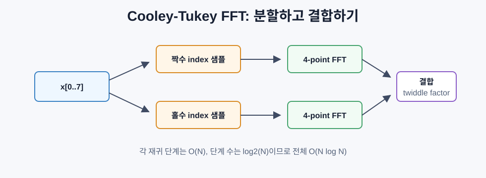
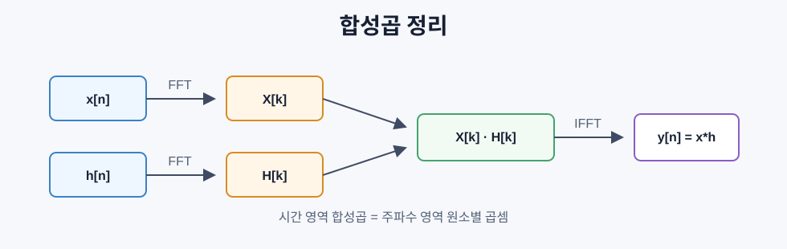

# 푸리에 변환

> 모든 신호는 여러 사인파의 합으로 볼 수 있다. 푸리에 변환은 어떤 주파수가 얼마나 들어 있는지 알려준다.

## 시간 영역과 주파수 영역

오디오, 주가, 센서값, 이미지 픽셀은 보통 시간 또는 공간 순서로 저장된다. 이것이 시간 영역 또는 공간 영역이다.

하지만 어떤 패턴은 값의 나열로 보면 잘 보이지 않는다.

- 오디오가 단일 음인지 화음인지
- 시계열에 주간/월간 주기가 있는지
- 이미지에 반복 질감이 있는지

푸리에 변환은 신호를 주파수 영역으로 옮긴다. 같은 정보를 다른 기저로 표현하는 것이다.

## DFT 정의

`N`개의 샘플 `x[0], ..., x[N-1]`이 있을 때 이산 푸리에 변환은 `N`개의 주파수 계수를 만든다.

```text
X[k] = sum_{n=0}^{N-1} x[n] e^(-2 pi i k n / N)
k = 0, 1, ..., N-1
```

각 `X[k]`는 복소수다.

```text
|X[k]|      주파수 k의 진폭
angle(X[k]) 주파수 k의 위상
|X[k]|^2    파워
```

핵심은 `e^(-2 pi i k n / N)`가 주파수 `k`로 회전하는 페이저라는 점이다. DFT는 신호와 각 페이저의 상관을 계산한다.

## 계수의 의미

| 계수 | 의미 |
|---|---|
| `X[0]` | DC 성분, 신호의 합 또는 평균 |
| `X[1] ... X[N/2-1]` | 양의 주파수 |
| `X[N/2]` | 나이퀴스트 주파수 |
| `X[N/2+1] ... X[N-1]` | 음의 주파수 |

나이퀴스트 주파수는 샘플링된 신호에서 구분할 수 있는 가장 높은 주파수다. 초당 `f_s`번 샘플링하면 `f_s / 2`이며, `X[N/2]`는 양의 주파수와 음의 주파수가 만나는 경계다.

실수 신호에서는 켤레 대칭이 있다.

```text
X[N-k] = conj(X[k])
```

그래서 실제 정보는 보통 앞쪽 절반에 들어 있다.

## 역 DFT

IDFT는 주파수 계수로 원래 신호를 복원한다.

```text
x[n] = (1/N) sum_{k=0}^{N-1} X[k] e^(2 pi i k n / N)
```

정방향 DFT와 다른 점은 두 가지다.

- 지수의 부호가 반대다.
- `1/N`으로 정규화한다.

DFT는 정보 손실이 아니라 기저 변환이다. DFT 후 IDFT를 하면 원래 신호로 돌아온다.

## FFT: 빠른 속도를 위한 방법

DFT를 정의 그대로 계산하면 `O(N^2)`이다. `N`개의 계수마다 `N`번 더해야 한다.

FFT는 같은 결과를 `O(N log N)`에 계산한다. 가장 대표적인 Cooley-Tukey FFT는 신호를 짝수 인덱스와 홀수 인덱스로 나누어 재귀적으로 푼다.

```text
E = DFT of x[0], x[2], x[4], ...
O = DFT of x[1], x[3], x[5], ...

X[k]       = E[k] + e^(-2 pi i k / N) O[k]
X[k+N/2]   = E[k] - e^(-2 pi i k / N) O[k]
```



`e^(-2 pi i k / N)`를 twiddle factor라고 부른다. FFT는 2의 거듭제곱 길이에서 가장 깔끔하게 작동하며, 실전에서는 0 채우기를 자주 한다.

## 파워 스펙트럼과 위상 스펙트럼

파워 스펙트럼은 각 주파수의 에너지다.

```text
P[k] = |X[k]|^2 = real(X[k])^2 + imag(X[k])^2
```

위상 스펙트럼은 각 주파수가 어디서 시작하는지 나타낸다.

```text
phi[k] = atan2(imag(X[k]), real(X[k]))
```

분석에서는 파워만 봐도 충분한 경우가 많지만, 복원에는 위상도 중요하다.

## 주파수 분해능

샘플링 주파수가 `fs`, 샘플 수가 `N`이면:

```text
bin k의 주파수:       f_k = k fs / N
해상도:               delta_f = fs / N
최대 주파수:          f_max = fs / 2
```

가까운 두 주파수를 구분하려면 더 긴 관측 시간이 필요하다.

```text
T = N / fs
delta_f = 1 / T
```

## 합성곱 정리

푸리에 변환의 가장 중요한 성질 중 하나는 합성곱 정리다.

```text
시간 영역 합성곱
<=>
주파수 영역 원소별 곱셈

x * h = IFFT(FFT(x) . FFT(h))
```

직접 합성곱은 길이에 따라 `O(NM)`이지만, FFT 기반 합성곱은 대략 `O(N log N)`으로 가능하다.



주의할 점은 DFT가 기본적으로 순환 합성곱을 계산한다는 것이다. 일반적인 선형 합성곱을 원하면 길이를 `N + M - 1` 이상으로 0 채우기해야 한다.

## 윈도우

DFT는 입력 샘플이 한 주기이고, 그 주기가 무한히 반복된다고 가정한다. 시작과 끝이 자연스럽게 이어지지 않으면 경계에 불연속이 생기고, 가짜 고주파 성분이 퍼진다. 이것이 스펙트럼 누출이다.

창 함수 적용은 양끝을 부드럽게 줄여 누출을 완화한다.

| 창문 | 특징 | 사용 |
|---|---|---|
| Rectangular | 아무 처리 없음, 주엽 좁음, 부엽 큼 | 정확히 주기적일 때 |
| Hann | 일반 목적, 누출 감소 | 스펙트럼 분석 |
| Hamming | 부엽 더 낮음 | 오디오/음성 |
| Blackman | 부엽 매우 낮음, 주엽 넓음 | 억제가 중요할 때 |

```text
Hann:
w[n] = 0.5 (1 - cos(2 pi n / (N - 1)))
```

## DFT의 주요 성질

| 성질 | 시간 영역 | 주파수 영역 |
|---|---|---|
| 선형성 | `a x + b y` | `a X + b Y` |
| 시간 이동 | `x[n - m]` | 위상 곱셈 |
| 주파수 이동 | 복소 지수 곱셈 | 계수 이동 |
| 합성곱 | `x * h` | 원소별 곱셈 |
| 원소별 곱셈 | `x h` | 순환 합성곱 |
| 에너지 | `sum |x[n]|^2` | Parseval 정리로 보존 |

Parseval 정리:

```text
sum |x[n]|^2 = (1/N) sum |X[k]|^2
```

## STFT와 스펙트로그램

한 번의 FFT는 전체 구간의 주파수만 알려준다. 어떤 주파수가 언제 나타났는지는 모른다.

STFT는 짧은 창을 겹쳐 가며 FFT를 계산한다.

```text
1. 창 크기 선택
2. 이동 간격 선택
3. 각 창마다 창 함수 적용
4. FFT 계산
5. 크기 스펙트럼을 열로 저장
```

결과가 스펙트로그램이다. 축은 시간과 주파수이고, 값은 에너지다. 음성 모델은 보통 mel-spectrogram을 입력으로 쓴다.

## 에일리어싱

샘플링 주파수가 `fs`이면 표현 가능한 최대 주파수는 `fs/2`다. 이보다 높은 주파수는 낮은 주파수처럼 보인다.

```text
90 Hz 신호를 100 Hz로 샘플링
-> 겉보기 주파수: 10 Hz
```

한 번 에일리어싱이 생기면 샘플만 보고 원래 고주파를 복구할 수 없다. 그래서 다운샘플링 전에는 저역통과 필터링이 필요하다.

## 0 채우기의 오해

0 채우기는 스펙트럼을 더 부드럽게 보이게 하지만 진짜 주파수 해상도를 높이지 않는다.

```text
진짜 해상도 = fs / N = 1 / 관측 시간
```

더 가까운 주파수를 구분하려면 0을 더 붙이는 것이 아니라 더 오래 관측해야 한다.
