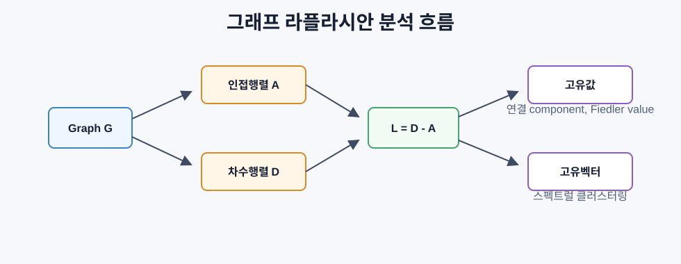
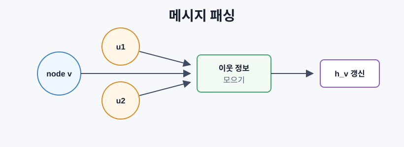
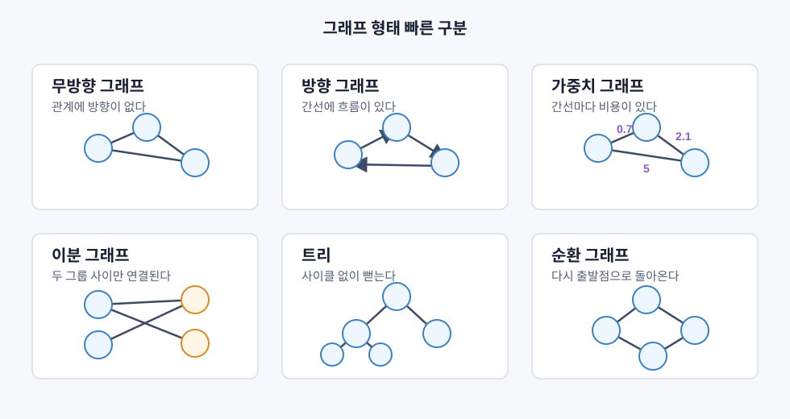
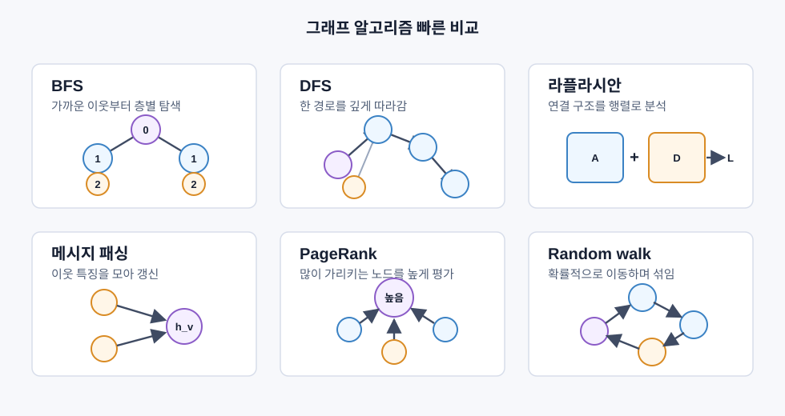

# 머신러닝을 위한 그래프 이론

> 그래프는 관계를 담는 자료구조다. 데이터의 핵심이 연결이라면 표만으로는 부족하다.

## 그래프가 필요한 이유

많은 데이터는 독립적인 행이 아니라 관계망이다.

- 소셜 네트워크: 친구 관계가 구매나 관심사를 설명한다.
- 분자: 원자 하나하나보다 결합 구조가 성질을 결정한다.
- 지식 그래프: 개체 사이의 간선이 의미를 만든다.
- 인용/웹 그래프: 링크 구조가 중요도를 만든다.

그래프 신경망은 이 관계 구조를 직접 학습한다. 그 바닥에는 인접행렬, 그래프 탐색, 라플라시안, 메시지 패싱이 있다.

## 그래프의 기본 구성

그래프는 노드와 간선으로 이루어진다.

```text
G = (V, E)
V: 정점 또는 노드
E: 간선
```

| 구분 | 의미 | 예시 |
|---|---|---|
| 무방향 그래프 | `u-v`가 양방향 | 친구 관계 |
| 방향 그래프 | `u -> v` 한 방향 | 팔로우, 웹 링크 |
| 비가중 그래프 | 간선 유무만 있음 | 단순 연결 |
| 가중 그래프 | 간선에 값이 있음 | 거리, 비용, 강도 |

## 인접행렬

노드가 `n`개인 그래프의 인접행렬 `A`는 다음처럼 정의된다.

```text
A[i][j] = 1    i -> j 간선이 있으면
A[i][j] = 0    그렇지 않으면
```

가중 그래프에서는 `A[i][j]`가 간선 가중치다. 무방향 그래프에서는 `A`가 대칭이다.

```text
삼각형 그래프: 간선 (0,1), (1,2), (0,2)

A = [[0, 1, 1],
     [1, 0, 1],
     [1, 1, 0]]
```

GNN은 그래프를 행렬 연산으로 처리하기 때문에 인접행렬이 핵심 입력이 된다.

## 차수와 차수행렬

차수는 노드에 연결된 간선 수다.

```text
degree(i) = sum_j A[i][j]
```

차수행렬 `D`는 대각행렬이다.

```text
D[i][i] = degree(i)
D[i][j] = 0 if i != j
```

차수는 허브 노드를 찾는 기본 특징이다. 소셜 네트워크는 보통 소수의 허브와 다수의 낮은 차수 노드를 가진다.

## BFS와 DFS

그래프 탐색은 그래프를 훑는 기본 알고리즘이다.

| 알고리즘 | 자료구조 | 특징 | 사용 |
|---|---|---|---|
| BFS | 큐 | 가까운 노드부터 단계별 탐색 | 비가중 최단 경로 |
| DFS | 스택/재귀 | 깊게 들어간 뒤 되돌아옴 | 연결 성분, 사이클, 위상 정렬 |

BFS는 시작점에서 몇 홉 떨어져 있는지를 자연스럽게 계산한다.

```text
시작 0
단계 0: 0
단계 1: 0의 이웃
단계 2: 단계 1의 이웃
```

DFS는 한 경로를 끝까지 따라가며 그래프의 구조적 조각을 찾는 데 좋다.

## 그래프 라플라시안

그래프 라플라시안은 스펙트럴 그래프 이론의 핵심 행렬이다.

```text
L = D - A
```

삼각형 그래프에서는:

```text
D = [[2,0,0],      A = [[0,1,1],
     [0,2,0],           [1,0,1],
     [0,0,2]]           [1,1,0]]

L = [[ 2,-1,-1],
     [-1, 2,-1],
     [-1,-1, 2]]
```

라플라시안의 중요한 성질:

- 모든 고유값이 0 이상이다.
- 0 고유값의 개수는 연결 성분의 개수다.
- 가장 작은 0이 아닌 고유값은 Fiedler value다.
- Fiedler value가 클수록 그래프가 잘 연결되어 있다.
- Fiedler vector는 그래프를 두 군집으로 나누는 힌트를 준다.



## 스펙트럴 클러스터링

스펙트럴 클러스터링은 그래프 구조를 고유벡터 좌표로 바꾼 뒤 군집화한다.

```text
1. L = D - A 계산
2. L의 작은 고유벡터들을 구함
3. 첫 번째 자명한 고유벡터는 건너뜀
4. 다음 고유벡터들을 노드 특징으로 사용
5. k-means 또는 부호 기준 분할 적용
```

`k=2`일 때는 Fiedler vector의 부호만으로도 두 군집을 나눌 수 있다.

```text
Fiedler vector 값 >= 0 -> 그룹 A
Fiedler vector 값 < 0  -> 그룹 B
```

잘 연결된 노드들은 비슷한 고유벡터 값을 갖고, 병목으로 분리된 노드들은 다른 값을 갖는다.

## Random walk와 스펙트럴 갭

그래프 위 random walk는 현재 노드에서 이웃 노드로 확률적으로 이동하는 과정이다. 정상분포는 차수에 비례한다.

```text
pi_i는 degree(i)에 비례
```

혼합 시간은 walk가 정상분포에 가까워지는 속도다. 이 속도는 스펙트럴 갭과 관련이 있다. 갭이 크면 빠르게 섞이고, 작으면 커뮤니티나 병목 때문에 천천히 섞인다.

## 메시지 전달

GNN의 핵심 연산은 메시지 패싱이다. 각 노드가 이웃의 특징을 모아 자기 상태를 갱신한다.

```text
h_v^(k+1) = UPDATE(
  h_v^(k),
  AGGREGATE({h_u^(k) : u in neighbors(v)})
)
```

가장 단순하게는 이웃 특징의 평균을 낸 뒤 선형 변환과 활성화 함수를 적용한다.

```text
H^(k+1) = sigma(A_norm H^(k) W)
```

한 번 메시지 패싱하면 1-hop 이웃 정보를 본다. 두 번 하면 2-hop, `K`번 하면 `K`-hop 이웃 정보가 들어온다.



## GCN과 라플라시안의 연결

GCN은 인접행렬에 자기 루프를 더하고 대칭 정규화를 한다.

```text
A_hat = A + I
H^(l+1) = sigma(D_hat^(-1/2) A_hat D_hat^(-1/2) H^(l) W^(l))
```

자기 루프는 노드가 자기 특징도 같이 보게 한다. 정규화는 차수가 큰 노드가 과도하게 영향을 주는 것을 막는다.

이 정규화는 정규화 라플라시안과 깊게 연결된다.

```text
L_sym = I - D^(-1/2) A D^(-1/2)
```

그래서 라플라시안을 이해하면 GCN이 왜 "그래프 평활화 + 학습 가능한 변환"처럼 작동하는지 이해할 수 있다.

## 주요 개념과 머신러닝 연결

다음 두 그림은 자주 나오는 그래프 형태와 알고리즘을 빠르게 구분하기 위한 요약이다.





| 그래프 개념 | 머신러닝 적용 |
|---|---|
| 인접행렬 | GCN, GAT, GraphSAGE 입력 |
| 차수 | 노드 중요도, 특징 설계 |
| BFS | 지식 그래프 탐색, 최단 경로 |
| DFS | 연결 성분, 사이클 탐지 |
| 라플라시안 | 스펙트럴 클러스터링, 그래프 분할 |
| Fiedler vector | 커뮤니티 분할 |
| 메시지 패싱 | 모든 GNN 층의 기본 |
| PageRank | 노드 순위화, 웹 검색 |
| 스펙트럴 갭 | random walk 혼합, 연결성 |
