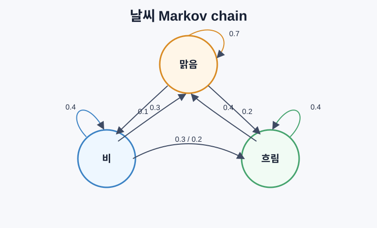
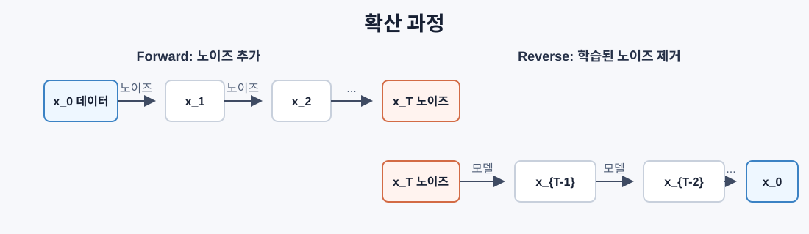

# 확률 과정

> 확률 과정은 시간이 있는 무작위성이다. 무작위 보행, 마르코프 체인, 확산 모델은 모두 이 언어로 설명된다.

## 확률 과정이란 무엇인가

확률 과정은 시간이 지나며 변하는 확률변수들의 모음이다.

```text
X_0, X_1, X_2, ...
```

중요한 점은 무작위지만 아무렇게나가 아니라, 이전 상태와 전이 규칙에 의해 구조화된다는 것이다.

인공지능에서는 계속 등장한다.

- 대규모 언어 모델(LLM): 토큰을 하나씩 샘플링한다.
- 확산 모델: 노이즈를 조금씩 더하고, 다시 조금씩 제거한다.
- 강화학습: 상태에서 행동을 취하면 확률적으로 다음 상태가 정해진다.
- 마르코프 체인 몬테카를로(MCMC): 원하는 분포를 정상분포로 갖는 체인을 만든다.

## 무작위 보행

가장 단순한 확률 과정은 무작위 보행이다.

```text
0에서 시작
각 단계:
  확률 0.5로 +1
  확률 0.5로 -1
```

`n` 단계 뒤 위치는 독립적인 `+1/-1` 확률변수의 합이다.

```text
S_n = X_1 + X_2 + ... + X_n
E[S_n] = 0
Var(S_n) = n
Std(S_n) = sqrt(n)
```

평균 위치는 0이지만, 원점에서의 전형적인 거리는 `sqrt(n)`만큼 커진다.

```text
n = 100      예상 규모 ~ 10
n = 10000    예상 규모 ~ 100
```

이 `sqrt(n)` 크기 변화는 독립적인 노이즈가 더해질 때 자주 나타난다. SGD 노이즈, 샘플링 오차, 몬테카를로 오차에도 비슷한 감각이 들어 있다.

## 브라운 운동

무작위 보행의 단계 크기를 줄이고 단계 수를 무한히 늘리면 브라운 운동이 된다.

```text
B(0) = 0
B(t) - B(s) ~ 정규분포(0, t - s)
겹치지 않는 구간의 증가량은 독립
```

시뮬레이션은 다음처럼 한다.

```text
B(t + dt) = B(t) + sqrt(dt) z
z ~ N(0, 1)
```

`sqrt(dt)`가 중요하다. 분산이 시간 간격에 비례해야 하기 때문이다.

브라운 운동은 확산 모델의 정방향 노이즈 추가 과정을 이해하는 바탕이다.

## 도박꾼의 파멸

무작위 보행자가 `k`에서 시작하고, `0`과 `N`이 흡수 경계라고 하자. 공정한 보행에서 `N`에 먼저 도착할 확률은 다음과 같다.

```text
P(0보다 N에 먼저 도착) = k / N
```

공정한 무작위 보행은 마팅게일이다. 현재 값이 미래 값의 기대값이다.

## 마르코프 체인

마르코프 체인은 다음 상태가 현재 상태에만 의존하는 확률 과정이다.

```text
P(X_{t+1}=j | X_t=i, X_{t-1}, ...)
= P(X_{t+1}=j | X_t=i)
```

이 성질을 마르코프 성질이라고 한다. 전체 동역학은 전이행렬 `P`로 표현된다.

```text
P[i][j] = 상태 i에서 상태 j로 갈 확률
```

각 행은 확률분포이므로 합이 1이다.

```text
날씨 상태: 맑음, 비, 흐림

P = [[0.7, 0.1, 0.2],
     [0.3, 0.4, 0.3],
     [0.4, 0.2, 0.4]]
```



## 정상분포

많은 마르코프 체인은 오래 지나면 시작 상태와 상관없이 일정한 분포로 수렴한다. 이를 정상분포라고 한다.

```text
pi P = pi
```

즉 `pi`는 전이를 한 번 적용해도 변하지 않는다. `P^T`의 고유값 1에 대응하는 고유벡터로 구할 수 있다.

```text
거듭제곱 방법:
  분포 <- 분포 @ P
  반복하면 pi로 수렴
```

고유한 정상분포로 수렴하려면 보통 다음 조건이 필요하다.

- 기약성: 모든 상태가 서로 도달 가능
- 비주기성: 고정된 주기로만 순환하지 않음

## 흡수 상태와 혼합 시간

흡수 상태는 한 번 들어가면 나갈 수 없는 상태다.

```text
P[i][i] = 1
```

게임 종료, 고객 이탈, 문장 끝 토큰처럼 종료 상태를 모델링한다.

혼합 시간은 체인이 정상분포에 가까워지는 데 걸리는 시간이다. 스펙트럴 갭이 크면 빠르게 섞이고, 작으면 오래 걸린다.

```text
스펙트럴 갭 = 1 - 두 번째로 큰 고유값
갭이 클수록 더 빠르게 섞임
```

MCMC를 돌릴 때 혼합이 느리면 샘플을 많이 뽑아도 서로 강하게 상관되어 쓸모가 줄어든다.

## 대규모 언어 모델 샘플링과 마르코프 관점

대규모 언어 모델의 토큰 생성은 엄밀히는 긴 문맥을 조건으로 하지만, "현재 문맥 상태에서 다음 토큰으로 전이한다"는 점에서 마르코프 과정처럼 볼 수 있다.

```text
P(token_i) = exp(logit_i / T) / sum_j exp(logit_j / T)
```

온도는 전이분포의 날카로움을 바꾼다.

| 설정 | 효과 |
|---|---|
| `T -> 0` | 거의 탐욕적 선택 |
| `T < 1` | 더 결정적 |
| `T = 1` | 기본 소프트맥스 |
| `T > 1` | 더 다양하고 무작위적 |

상위 k개 샘플링과 누적확률 샘플링은 전이분포를 잘라내고 다시 정규화하는 방식이다.

## 랑주뱅 동역학

랑주뱅 동역학은 경사하강법에 노이즈를 더한 과정이다.

```text
x_{t+1} = x_t - dt grad U(x_t)
          + sqrt(2 T dt) z_t
```

두 힘이 동시에 작용한다.

- 기울기 힘: 낮은 에너지 쪽으로 이동
- 무작위 힘: 탐색을 위해 흔들림 추가

`T = 0`이면 경사하강법이 되고, `T`가 크면 무작위 보행에 가까워진다. 평형 상태에서는 `exp(-U(x)/T)`에 비례하는 분포에서 샘플이 나온다.

점수 기반 생성 모델과 확률적 기울기 랑주뱅 동역학(SGLD)은 이 아이디어를 머신러닝에 직접 사용한다.

## MCMC와 메트로폴리스-헤이스팅스

어떤 분포 `p(x)`에서 직접 샘플링할 수는 없지만, 비정규화된 밀도는 계산할 수 있다고 하자. 베이즈 사후분포가 대표적이다.

메트로폴리스-헤이스팅스는 `p(x)`를 정상분포로 갖는 마르코프 체인을 만든다.

```text
1. 현재 위치 x에서 시작
2. 제안분포 Q(x' | x)로 x' 제안
3. 수용 비율 계산

a = p(x') Q(x | x') / (p(x) Q(x' | x))

4. min(1, a) 확률로 수용
5. 아니면 x에 머무름
```

제안분포가 대칭이면 단순해진다.

```text
a = p(x') / p(x)
```

정규화 상수는 비율에서 사라지기 때문에 몰라도 된다.

## 상세 균형

메트로폴리스-헤이스팅스가 작동하는 이유는 상세 균형을 만족하도록 수용 비율을 설계하기 때문이다.

```text
pi(x) P(x -> x') = pi(x') P(x' -> x)
```

이 조건이 있으면 `pi`가 정상분포가 된다. 충분히 오래 체인을 돌리면 목표분포에서 샘플링한 것처럼 사용할 수 있다.

실전에서는 다음을 본다.

- 초기 버림: 초반 샘플 제거
- 간격 저장: 자기상관을 줄이기 위해 간격을 두고 저장
- 여러 체인: 시작점이 달라도 같은 분포로 가는지 확인
- 수용률: 너무 높으면 거의 제자리, 너무 낮으면 거절 과다

## 확산 모델과 마르코프 체인

잡음 제거 확산 확률 모델(DDPM)의 정방향 과정은 데이터에 노이즈를 점진적으로 섞는 마르코프 체인이다.

```text
q(x_t | x_{t-1})
= N(x_t; sqrt(1 - beta_t) x_{t-1}, beta_t I)
```

간단히 쓰면:

```text
x_t = sqrt(alpha_t) x_{t-1}
      + sqrt(1 - alpha_t) epsilon
```

충분히 많은 단계 뒤에는 `x_T`가 거의 가우시안 노이즈가 된다.

역방향 과정은 신경망이 학습한다.

```text
p_theta(x_{t-1} | x_t)
= N(x_{t-1}; mu_theta(x_t, t), sigma_t^2 I)
```



확산 생성은 학습된 역방향 마르코프 체인을 노이즈에서 데이터 방향으로 실행하는 것이다.

## 확률 과정 한눈에 보기

| 과정 | 핵심 질문 | 대표 형태 | 머신러닝 연결 |
|---|---|---|---|
| 랜덤 워크 | 다음에 왼쪽으로 갈까, 오른쪽으로 갈까? | 독립적인 작은 이동의 합 | 샘플링 오차, 노이즈 분석 |
| 브라운 운동 | 시간을 아주 잘게 쪼개면 노이즈가 어떻게 누적될까? | 연속 시간 무작위 보행 | 확산 모델의 노이즈 과정 |
| 마르코프 체인 | 다음 상태가 현재 상태만으로 정해질까? | 전이행렬 `P` | MCMC, 강화학습 상태 전이 |
| 랑주뱅 동역학 | 낮은 에너지로 가면서도 탐색할 수 있을까? | 경사하강법 + 노이즈 | 점수 기반 생성, SGLD |
| 메트로폴리스-헤이스팅스 | 어려운 분포에서 어떻게 샘플을 뽑을까? | 제안 후 수용/거절 | 베이즈 추론, MCMC |
| 확산 모델 | 노이즈를 되돌려 데이터로 만들 수 있을까? | 정방향 노이즈 + 역방향 복원 | 이미지/오디오/비디오 생성 |
