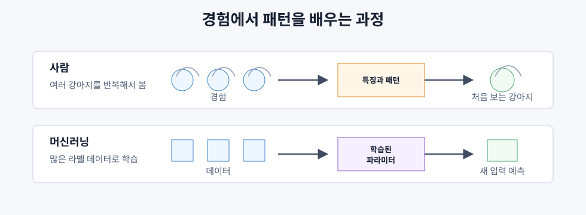
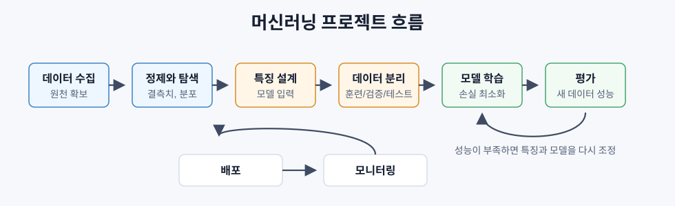

# 머신러닝이란 무엇인가

> 머신러닝은 사람이 규칙을 직접 쓰는 대신, 데이터에서 규칙을 학습하게 하는 방법이다.

## 핵심 아이디어

전통적인 프로그래밍은 사람이 규칙을 만들고, 프로그램이 그 규칙을 데이터에 적용한다.

```text
규칙 + 데이터 -> 프로그램 -> 출력
```

머신러닝은 방향이 다르다. 데이터와 기대 출력을 주면, 학습 알고리즘이 규칙에 해당하는 모델을 만든다.

```text
데이터 + 기대 출력 -> 학습 알고리즘 -> 모델
```

훈련이 끝난 모델은 숫자로 저장된 규칙이다. 이 숫자는 보통 가중치, 편향, 파라미터라고 부른다. 좋은 모델은 훈련 데이터만 외우는 것이 아니라, 처음 보는 데이터에도 비슷한 패턴을 적용한다.

### 인간의 직관과 닮은 점



머신러닝의 학습 방식은 사람이 경험을 통해 직관을 형성하는 과정과 일부 닮아 있다. 사람은 강아지를 알아볼 때 보통 `귀 길이가 몇 cm이고 코 모양이 어떠하면 강아지` 같은 규칙을 하나씩 세우지 않는다.

대신 여러 강아지를 반복해서 보고 경험하면서 공통적인 특징과 패턴을 익힌다. 그래서 처음 보는 강아지도 자연스럽게 알아본다. 머신러닝도 비슷하게 많은 데이터에서 반복되는 패턴을 학습하고, 그 패턴을 처음 보는 데이터에 적용한다.

경험이 많은 사람이 "정확히 설명하기는 어렵지만 뭔가 이상하다"고 빠르게 판단하는 것도 비슷한 비유로 볼 수 있다. 많은 경험에서 얻은 패턴이 압축되어 새로운 상황을 판단하는 데 쓰이는 것이다.

다만 인간의 직관과 머신러닝이 동일한 것은 아니다. 인간은 맥락, 인과관계, 목적, 신체 경험, 세계에 대한 지식까지 함께 사용한다. 머신러닝은 인간의 직관 그 자체라기보다, 경험에서 패턴을 학습해 새로운 상황에 적용한다는 점에서 직관이 형성되는 방식의 일부와 닮아 있다.

## 머신러닝의 세 가지 큰 유형

| 유형 | 데이터 형태 | 목표 | 예시 |
|---|---|---|---|
| 지도학습 | 입력과 정답이 함께 있음 | 입력에서 정답을 예측 | 스팸 분류, 집값 예측 |
| 비지도학습 | 입력만 있음 | 데이터 안의 구조 발견 | 고객 군집화, 차원 축소 |
| 강화학습 | 상태, 행동, 보상 | 보상을 크게 만드는 정책 학습 | 게임, 로봇 제어, RLHF |

실무에서는 지도학습이 가장 자주 쓰인다. 비지도학습은 탐색과 전처리에 많이 쓰이고, 강화학습은 행동을 선택해야 하는 문제에 쓰인다.

### 지도학습과 라벨링

지도학습에서 라벨은 모델이 맞혀야 하는 정답이다. 예를 들어 이메일 데이터에는 `스팸/정상`, 이미지 데이터에는 `고양이/강아지`, 집 정보 데이터에는 `실제 가격`이 라벨이 된다.

라벨링은 이런 정답을 데이터에 붙이는 작업이다. 좋은 라벨이 있어야 모델이 입력과 정답 사이의 패턴을 배울 수 있다. 라벨이 틀리거나 기준이 흔들리면 모델도 그 흔들린 기준을 그대로 배우게 된다.

## 지도학습의 두 기본 문제

| 구분 | 분류 | 회귀 |
|---|---|---|
| 질문 | 어떤 범주인가? | 값이 얼마인가? |
| 출력 | 이산적인 클래스 | 연속적인 숫자 |
| 예시 | 이메일이 스팸인가? | 집값은 얼마인가? |
| 대표 손실 | 교차 엔트로피, 정확도 | 평균제곱오차, 평균절대오차 |

분류는 `고양이/강아지`, `스팸/정상`처럼 범주를 고른다. 회귀는 가격, 온도, 수요량처럼 숫자를 예측한다.

## 반지도학습과 자기지도학습

현실의 데이터는 세 가지 유형으로 깔끔하게 나뉘지 않는다.

반지도학습은 적은 양의 라벨 데이터와 많은 양의 라벨 없는 데이터를 함께 사용한다.

- 라벨 전파: 비슷한 데이터끼리 그래프로 연결하고, 라벨을 이웃으로 퍼뜨린다.
- 의사 라벨링: 모델이 라벨 없는 데이터에 임시 라벨을 붙이고, 그 라벨로 다시 학습한다.
- 일관성 정규화: 입력을 조금 바꿔도 모델의 예측이 크게 바뀌지 않게 만든다.

자기지도학습은 데이터 자체에서 학습 신호를 만든다.

- 마스크드 언어 모델링 (BERT): 문장에서 일부 단어를 가리고 맞히게 한다.
- 대조 학습 (SimCLR): 이미지의 두 증강 버전이 같은 원본에서 왔음을 맞히게 한다.
- 다음 토큰 예측(GPT): 이전 토큰들을 보고 다음 토큰을 예측하게 한다.

사람이 직접 붙인 라벨은 없지만, 모델 입장에서는 여전히 예측 문제를 푸는 셈이다.

## 머신러닝 워크플로우

대부분의 머신러닝 프로젝트는 같은 순서를 따른다.



```text
-> 데이터 수집
-> 정제와 탐색
-> 특징 설계
-> 훈련/검증/테스트 분리
-> 모델 학습
-> 평가
-> 배포
-> 모니터링
```

데이터 정제와 탐색은 전체 시간의 큰 비중을 차지한다. 모델이 바로 이해할 수 있게 데이터를 잘 가공한 입력값은 복잡한 알고리즘보다 성능에 더 큰 영향을 줄 때가 많다. 배포 이후에도 데이터 분포가 바뀌면 성능이 떨어지므로 계속 모니터링해야 한다.

## 훈련, 검증, 테스트 분리

모델은 훈련에 쓰지 않은 데이터에서 평가해야 한다. 그렇지 않으면 학습이 아니라 암기를 측정하게 된다.

| 분리 | 용도 | 언제 쓰는가 |
|---|---|---|
| 훈련 데이터 | 모델 파라미터 학습 | 학습 중 |
| 검증 데이터 | 하이퍼파라미터 조정, 모델 비교 | 여러 실험 사이 |
| 테스트 데이터 | 최종 성능 추정 | 마지막에 한 번 |

테스트 데이터는 최종 확인용이다. 테스트 결과를 보고 계속 모델을 고치면, 테스트 데이터도 사실상 학습에 사용한 것이 된다.

데이터가 작을 때는 k-겹 교차검증을 쓴다. 데이터를 k개 조각으로 나누고, 매번 하나를 검증용으로 돌려가며 평균 성능을 본다.

## 과적합 VS 과소적합

| 상태 | 특징 | 훈련 성능 | 새 데이터 성능 |
|---|---|---|---|
| 과소적합 | 모델이 너무 단순함 | 나쁨 | 나쁨 |
| 적절한 적합 | 실제 패턴을 잡음 | 좋음 | 좋음 |
| 과적합 | 훈련 데이터의 노이즈까지 외움 | 매우 좋음 | 나쁨 |

과적합의 신호는 훈련 성능이 검증 성능보다 훨씬 좋은 경우다.

과적합을 줄이는 방법:

- 훈련 데이터를 더 모은다.
- 모델을 단순하게 만든다.
- 정규화를 추가한다.
- 조기 종료를 사용한다.

과소적합을 줄이는 방법:

- 더 복잡한 모델을 쓴다.
- 더 좋은 특징을 추가한다.
- 정규화를 줄인다.
- 더 오래 학습한다.

## 편향-분산 트레이드오프

편향은 모델의 가정이 틀려서 생기는 오차다. 선형 모델로 곡선을 맞추려 하면 편향이 커진다.

분산은 훈련 데이터의 작은 변화에 모델이 민감하게 흔들려서 생기는 오차다. 너무 복잡한 모델은 분산이 커진다.

```text
전체 오차 = 편향^2 + 분산 + 줄일 수 없는 노이즈
```

목표는 편향과 분산이 모두 너무 크지 않은 지점을 찾는 것이다.

## 머신러닝을 쓰지 말아야 할 때

머신러닝은 강력하지만 항상 좋은 선택은 아니다.

- 규칙이 단순하고 명확하면 규칙 기반 코드가 낫다.
- 데이터가 거의 없으면 학습할 것이 없다.
- 틀리면 안 되는 문제에는 결정적 방법이 필요하다.
- 간단한 임계값이나 조회표로 충분하면 모델은 불필요한 복잡성이다.
- 설명 가능성이 엄격히 필요하면 해석 가능한 모델만 써야 한다.
- 문제가 너무 빨리 변하고 재학습이 느리면 모델이 금방 낡는다.

## 회사에서 AI를 사용할지 판단하는 기준

회사에서 AI를 쓰자는 말이 나올 때는 먼저 입출력이 분명한지 확인해야 한다. 어떤 데이터를 넣고, 어떤 결과를 받아서, 어떤 업무 판단이나 행동을 바꿀 것인지가 명확해야 한다.

간단한 기준은 다음과 같다.

| 질문 | 확인할 점 |
|---|---|
| 입력이 명확한가? | 사용할 데이터, 문서, 로그, 고객 정보의 범위가 정해져 있는가 |
| 출력이 명확한가? | 요약, 분류, 추천, 예측처럼 원하는 결과 형태가 분명한가 |
| 평가할 수 있는가? | 좋은 결과와 나쁜 결과를 구분할 기준이 있는가 |
| 검증할 사람이 있는가? | AI 결과를 확인하고 수정할 책임자가 있는가 |
| 기존 방식보다 나은가? | 규칙, 템플릿, 검색, 자동화보다 실제로 개선되는가 |

이 질문에 답하기 어렵다면 AI 모델부터 붙이기보다 데이터 상태, 업무 흐름, 성공 기준을 먼저 정리하는 편이 낫다.

### 입출력이 흐릴 때의 검증

입력과 출력을 명확히 정하기 어려운 업무에서는 AI가 찾은 패턴을 바로 의사결정에 쓰기보다 먼저 검증해야 한다. 같은 데이터에서 패턴을 찾고 같은 데이터로 맞는지 확인하면, 우연한 특징까지 그럴듯하게 배운 과적합을 놓치기 쉽다.

따라서 패턴을 찾은 데이터와 검증할 데이터를 분리한다. 과거 데이터 일부로 패턴을 찾고, AI가 보지 않은 다른 기간이나 다른 고객군에 적용해 실제 결과와 비교한다.

| 확인할 것 | 의미 |
|---|---|
| 새 데이터에서도 맞는가? | 과거 데이터만 외운 것이 아닌지 확인 |
| 중요한 사례를 놓치지 않는가? | 재현율 관점의 확인 |
| 잘못 판단했을 때 비용이 큰가? | 실패 비용 확인 |
| 사람이 봐도 말이 되는가? | 업무 맥락과 설명 가능성 확인 |

실무에서는 먼저 AI 판단을 기록만 하고, 기존 방식의 판단과 실제 결과를 비교하는 파일럿부터 시작하는 편이 좋다. 새 데이터에서도 반복해서 맞는 패턴일 때만 제한된 범위부터 적용한다.
