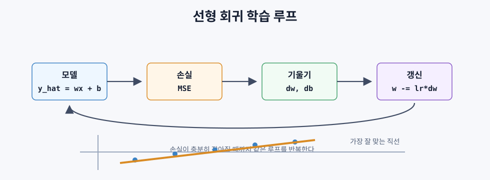
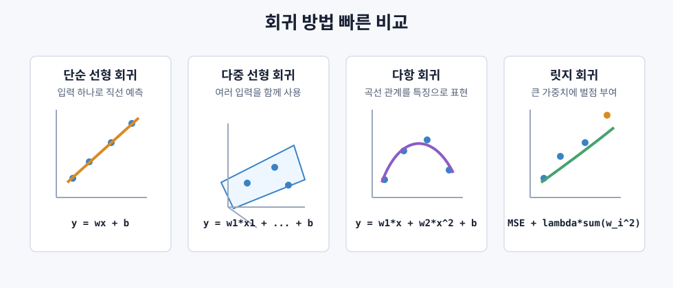

# 선형 회귀

> 선형 회귀는 데이터에 가장 잘 맞는 직선을 찾는 방법이다. 머신러닝 학습 루프의 가장 단순한 출발점이다.

## 문제 설정

집의 크기와 가격 데이터가 있다고 하자. 새 집의 크기를 알 때 가격을 예측하려면 데이터에 잘 맞는 식이 필요하다.

선형 회귀는 다음 형태의 직선을 학습한다.

```text
y = w x + b
```

- `w`: 가중치 또는 기울기. `x`가 1 증가할 때 `y`가 얼마나 변하는지 나타낸다.
- `b`: 편향 또는 절편. `x = 0`일 때의 예측값이다.

특징이 여러 개라면 다음처럼 확장된다.

```text
y = w1*x1 + w2*x2 + ... + wn*xn + b
```

목표는 모든 훈련 예제에서 예측값과 실제값의 차이가 작아지도록 `w`와 `b`를 찾는 것이다.

## 비용 함수: 평균제곱오차

예측이 얼마나 틀렸는지 하나의 숫자로 나타내야 한다. 선형 회귀에서 가장 자주 쓰는 비용 함수는 평균제곱오차다.

```text
MSE = (1/n) * sum((y_pred - y_actual)^2)
```

오차를 제곱하는 이유는 두 가지다.

- 양수 오차와 음수 오차가 서로 상쇄되지 않는다.
- 큰 오차를 더 강하게 벌한다.
- 함수가 매끄러워서 미분과 최적화가 쉽다.

선형 회귀의 평균제곱오차 표면은 보통 그릇 모양이다. 학습은 그 그릇의 가장 낮은 지점을 찾는 과정이다.

## 경사하강법

경사하강법은 비용 함수가 작아지는 방향으로 파라미터를 조금씩 움직인다.



```text
1. w와 b 초기화
2. 예측값 계산
3. 평균제곱오차 계산
4. 기울기 계산
5. w와 b를 반대 방향으로 갱신
6. 충분히 작아질 때까지 반복
```

단일 입력에서 기울기는 다음과 같다.

```text
dMSE/dw = (2/n) * sum((y_hat - y) * x)
dMSE/db = (2/n) * sum(y_hat - y)
```

갱신 규칙:

```text
w = w - learning_rate * dMSE/dw
b = b - learning_rate * dMSE/db
```

학습률은 한 번에 얼마나 움직일지 정한다. 너무 크면 최솟값을 지나쳐 발산하고, 너무 작으면 학습이 너무 느리다.

## 정규방정식

선형 회귀는 반복 학습 없이 한 번에 최적해를 구하는 공식도 있다.

```text
w = (X^T X)^(-1) X^T y
```

이 방법은 작은 데이터에서는 빠르고 정확하다. 하지만 특징 수가 많아지면 행렬 역행렬 계산 비용이 커진다. 큰 데이터에서는 보통 경사하강법이나 그 변형을 쓴다.

## 다중 선형 회귀

입력이 여러 개면 직선이 아니라 고차원 평면을 맞춘다.

```text
가격 = w1*면적 + w2*침실수 + w3*연식 + b
```

여기서 각 가중치는 다른 특징이 고정되어 있을 때 해당 특징이 예측값에 주는 영향을 뜻한다.

다중 선형 회귀에서는 특징 스케일링이 중요하다. 한 특징은 `0`에서 `1` 사이인데 다른 특징은 `0`에서 `1,000,000` 사이이면, 경사하강법이 한쪽 방향으로만 길게 늘어진 표면을 따라 움직여야 한다.

대표적인 표준화:

```text
x_scaled = (x - mean) / std
```

## 다항 회귀

관계가 직선이 아니어도 선형 회귀를 쓸 수 있다. 입력을 다항 특징으로 바꾸면 된다.

```text
y = w1*x + w2*x^2 + w3*x^3 + b
```

이 모델은 `x`에 대해서는 비선형이지만, 가중치 `w1`, `w2`, `w3`에 대해서는 여전히 선형이다.

차수를 너무 높이면 훈련 데이터에는 잘 맞지만 새 데이터에는 약해질 수 있다. 즉 과적합 위험이 커진다.

## R 제곱

평균제곱오차는 `y`의 단위와 크기에 영향을 받는다. R 제곱은 모델이 평균만 예측하는 기준보다 얼마나 나은지 보여준다.

```text
R^2 = 1 - SS_res / SS_tot
```

| 값 | 의미 |
|---|---|
| `R^2 = 1` | 완벽한 예측 |
| `R^2 = 0` | 평균을 예측하는 것과 비슷함 |
| `R^2 < 0` | 평균만 예측하는 것보다 나쁨 |

## 정규화 미리보기: 릿지 회귀

특징이 많으면 모델이 큰 가중치를 사용해 훈련 데이터에 과하게 맞출 수 있다. 릿지 회귀는 큰 가중치에 벌점을 준다.

```text
비용 = MSE + lambda * sum(w_i^2)
```

`lambda`가 클수록 가중치를 더 작게 만들고, 모델은 더 단순해진다. 이는 과적합을 줄이는 데 도움이 된다.

## 회귀 방법 한눈에 보기



| 방법 | 언제 쓰는가 | 특징 | 주의할 점 |
|---|---|---|---|
| 단순 선형 회귀 | 입력 특징이 하나일 때 | 데이터에 가장 잘 맞는 직선을 찾음 | 실제 관계가 곡선이면 잘 안 맞음 |
| 다중 선형 회귀 | 입력 특징이 여러 개일 때 | 여러 특징의 영향을 동시에 반영함 | 특징 스케일 차이가 크면 학습이 불안정함 |
| 다항 회귀 | 관계가 곡선처럼 보일 때 | `x^2`, `x^3` 같은 특징을 추가해 곡선을 맞춤 | 차수가 높으면 과적합되기 쉬움 |
| 릿지 회귀 | 특징이 많거나 과적합이 걱정될 때 | 큰 가중치에 벌점을 줘 모델을 부드럽게 만듦 | `lambda`가 너무 크면 과소적합될 수 있음 |

정규방정식은 별도의 회귀 종류라기보다 선형 회귀의 해를 구하는 방법이다. 작은 데이터에서는 한 번에 답을 구할 수 있고, 큰 데이터에서는 보통 경사하강법을 쓴다.

```text
회귀 방법 선택 기준:
입력이 하나인가?
-> 단순 선형 회귀

입력이 여러 개인가?
-> 다중 선형 회귀

직선으로 부족한가?
-> 다항 회귀

과적합이 걱정되는가?
-> 릿지 회귀
```
