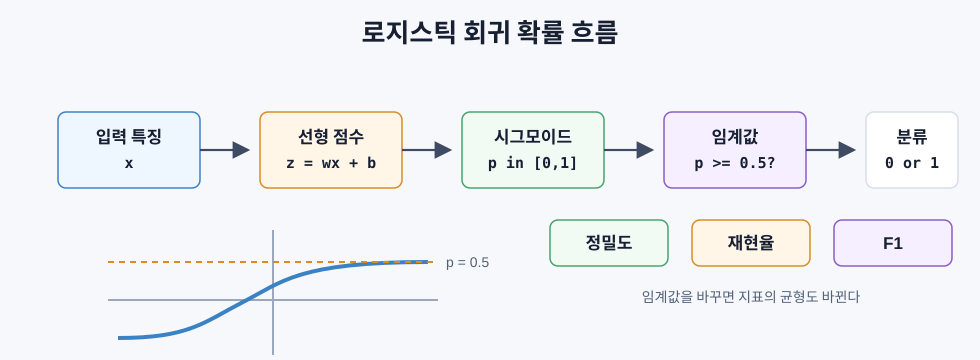
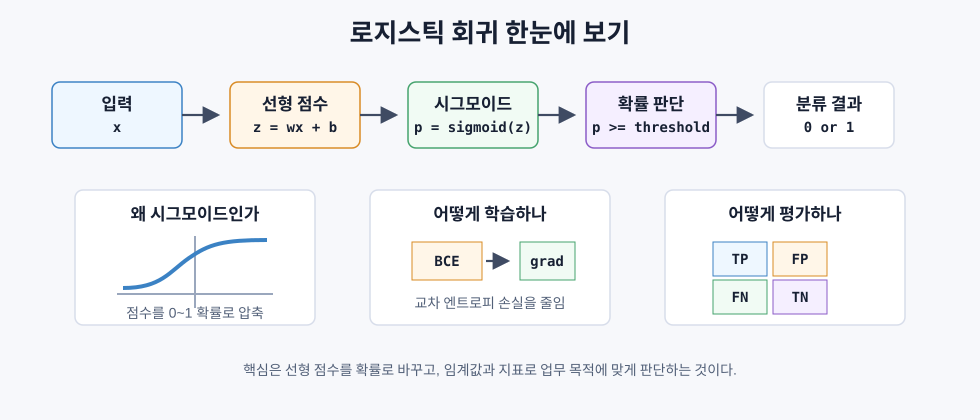

# 로지스틱 회귀

> 로지스틱 회귀는 직선 모델에 시그모이드를 붙여 예/아니오 문제를 확률로 예측한다.

## 문제 설정

종양의 크기를 보고 악성인지 양성인지 예측한다고 하자. 선형 회귀를 그대로 쓰면 `-0.5`, `1.7` 같은 값이 나올 수 있다. 분류 문제에서는 이런 값이 확률로 해석되지 않는다.

분류에는 두 가지가 필요하다.

- 출력이 `0`과 `1` 사이의 확률이어야 한다.
- 확률을 기준으로 클래스를 결정할 수 있어야 한다.

로지스틱 회귀는 선형 결합을 먼저 계산한 뒤, 시그모이드 함수로 확률로 바꾼다.

```text
z = w x + b
p = sigmoid(z)
```

이름에는 회귀가 들어가지만 실제로는 분류 알고리즘이다.

## 선형 회귀가 분류에 약한 이유

선형 회귀의 출력은 제한이 없다. 예측값이 0보다 작거나 1보다 클 수 있다.

```text
공부 시간 -> 합격 여부
1시간 -> 0
10시간 -> 1
선형 회귀 예측 -> -0.2 또는 1.3 가능
```

또 멀리 떨어진 이상치 하나가 직선을 크게 끌어당겨 결정 경계를 흔들 수 있다. 분류에는 확률처럼 해석 가능한 제한된 출력이 필요하다.

## 시그모이드 함수

시그모이드는 어떤 실수든 `0`과 `1` 사이로 눌러준다.

```text
sigmoid(z) = 1 / (1 + e^(-z))
```

| 입력 `z` | 출력 |
|---|---|
| 큰 양수 | 1에 가까움 |
| 0 | 0.5 |
| 큰 음수 | 0에 가까움 |

미분도 간단하다.

```text
sigmoid'(z) = sigmoid(z) * (1 - sigmoid(z))
```

이 성질 덕분에 기울기 계산이 깔끔해진다.

## 로지스틱 회귀 모델

전체 흐름은 다음과 같다.



```text
입력 x
-> 선형 점수 z = w x + b
-> 확률 p = sigmoid(z)
-> p >= 0.5이면 클래스 1
-> p < 0.5이면 클래스 0
```

출력 `p`는 다음처럼 해석한다.

```text
p = P(y = 1 | x)
```

결정 경계는 `w x + b = 0`인 지점이다. 이때 시그모이드 출력은 `0.5`다.

입력이 두 개라면 결정 경계는 다음 직선이다.

```text
w1*x1 + w2*x2 + b = 0
```

로지스틱 회귀의 기본 결정 경계는 선형이다. 곡선 경계가 필요하면 다항 특징을 추가하거나 비선형 모델을 사용한다.

## 이진 교차 엔트로피 손실

로지스틱 회귀에는 평균제곱오차보다 이진 교차 엔트로피가 더 적합하다.

```text
Loss = -(1/n) * sum(y * log(p) + (1-y) * log(1-p))
```

이 손실은 확신 있게 틀린 예측을 크게 벌한다.

| 실제값 | 예측 확률 | 손실 |
|---|---|---|
| `y = 1` | `p`가 1에 가까움 | 작음 |
| `y = 1` | `p`가 0에 가까움 | 큼 |
| `y = 0` | `p`가 0에 가까움 | 작음 |
| `y = 0` | `p`가 1에 가까움 | 큼 |

로지스틱 회귀에서 이 손실은 볼록한 비용 표면을 만들어 하나의 전역 최솟값을 찾을 수 있게 한다.

## 경사하강법

시그모이드와 이진 교차 엔트로피를 함께 쓰면 기울기가 단순해진다.

```text
dL/dw = (1/n) * sum((p - y) * x)
dL/db = (1/n) * sum(p - y)
```

형태는 선형 회귀와 비슷하다. 차이는 예측값이 `w x + b`가 아니라 `sigmoid(w x + b)`라는 점이다.

학습 루프:

```text
1. w와 b 초기화
2. z = w x + b 계산
3. p = sigmoid(z) 계산
4. 이진 교차 엔트로피 계산
5. 기울기 계산
6. w와 b 갱신
7. 수렴할 때까지 반복
```

## SOFTMAX를 이용한 다중 클래스 분류

클래스가 두 개보다 많으면 시그모이드 대신 소프트맥스를 쓴다.

```text
softmax(z_i) = e^(z_i) / sum(e^(z_j))
```

소프트맥스는 각 클래스 점수를 확률로 바꾸고, 모든 클래스 확률의 합이 1이 되게 한다. 예측 클래스는 확률이 가장 큰 클래스다.

손실 함수는 범주형 교차 엔트로피가 된다.

```text
Loss = -(1/n) * sum(sum(y_k * log(p_k)))
```

여기서 `y_k`는 정답 클래스만 1이고 나머지는 0인 원-핫 벡터다.

## 평가 지표

분류에서는 정확도만 보면 위험할 수 있다. 예를 들어 양성 데이터가 5%뿐이면, 항상 음성이라고 예측해도 정확도는 95%가 된다.

혼동 행렬은 예측과 실제를 네 가지로 나눈다.

| 구분 | 의미 |
|---|---|
| TP | 실제 양성을 양성으로 예측 |
| FP | 실제 음성을 양성으로 예측 |
| TN | 실제 음성을 음성으로 예측 |
| FN | 실제 양성을 음성으로 예측 |

주요 지표:

```text
정밀도 = TP / (TP + FP)
재현율 = TP / (TP + FN)
F1 = 2 * 정밀도 * 재현율 / (정밀도 + 재현율)
```

| 지표 | 중요해지는 경우 |
|---|---|
| 정밀도 | 거짓 양성이 비쌀 때. 예: 정상 메일을 스팸 처리하면 안 됨 |
| 재현율 | 거짓 음성이 비쌀 때. 예: 암 검진에서 놓치면 안 됨 |
| F1 | 정밀도와 재현율의 균형이 필요할 때 |

## 임계값 조정

기본 임계값은 보통 `0.5`다.

```text
p >= 0.5 -> 클래스 1
p < 0.5  -> 클래스 0
```

하지만 문제에 따라 임계값을 바꿀 수 있다. 임계값을 낮추면 더 많이 양성으로 잡아 재현율이 올라가지만, 거짓 양성도 늘어난다. 임계값을 높이면 정밀도는 올라갈 수 있지만, 놓치는 양성이 늘어난다.

## 로지스틱 회귀 한눈에 보기



| 항목 | 핵심 | 기억할 점 |
|---|---|---|
| 문제 유형 | 분류 | 이름은 회귀지만 출력은 클래스다 |
| 선형 점수 | `z = w x + b` | 입력을 하나의 점수로 합친다 |
| 시그모이드 | `p = sigmoid(z)` | 점수를 `0`과 `1` 사이 확률로 바꾼다 |
| 결정 경계 | `w x + b = 0` | 기본 경계는 직선이다 |
| 손실 함수 | 이진 교차 엔트로피 | 확신 있게 틀린 예측을 크게 벌한다 |
| 학습 방법 | 경사하강법 | `p - y`를 바탕으로 가중치를 갱신한다 |
| 다중 클래스 | 소프트맥스 | 클래스별 확률의 합이 `1`이 된다 |
| 평가 | 정밀도, 재현율, F1 | 데이터 불균형에서는 정확도만 보면 위험하다 |
| 임계값 | 보통 `0.5`에서 시작 | 낮추면 재현율, 높이면 정밀도가 올라가기 쉽다 |
