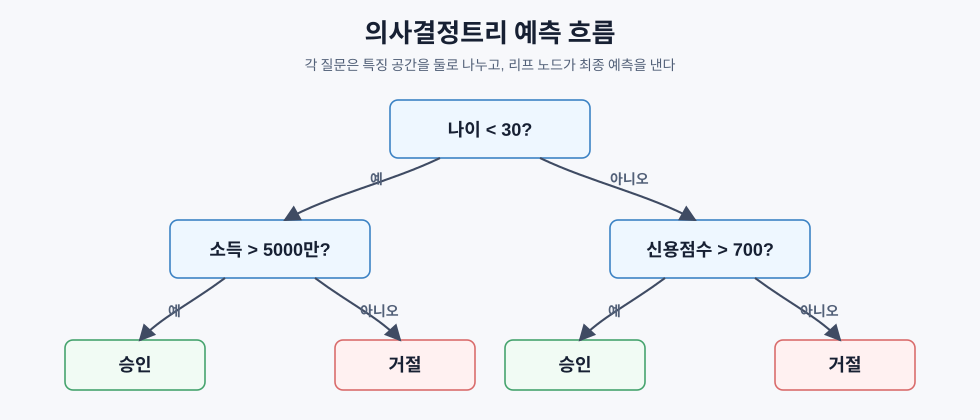
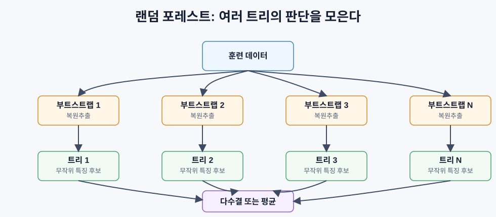

# 의사결정트리와 랜덤 포레스트

> 의사결정트리는 질문을 이어 붙여 데이터를 나누는 모델이고, 랜덤 포레스트는 그런 트리를 여러 개 평균내어 더 안정적인 예측을 만든다.

## 핵심 아이디어

의사결정트리는 데이터를 `if/else` 질문의 흐름으로 분할한다. 각 내부 노드는 하나의 특징과 임계값을 검사하고, 각 리프 노드는 최종 예측을 낸다.



트리의 학습은 위에서 아래로 진행된다. 현재 노드의 데이터를 가장 잘 나누는 특징과 임계값을 고르고, 왼쪽과 오른쪽 자식 노드에 같은 과정을 반복한다.

트리는 표 형태 데이터에 특히 강하다. 숫자형과 범주형 특징을 비교적 자연스럽게 다룰 수 있고, 비선형 관계와 특징 간 상호작용을 별도 수식 없이 포착한다. 무엇보다 어떤 질문을 거쳐 예측했는지 추적할 수 있어 해석 가능성이 높다.

## 순도와 불순도

좋은 분할은 자식 노드가 한 클래스에 가깝게 모이도록 만든다. 이를 측정하기 위해 불순도를 쓴다. 불순도가 낮을수록 노드가 더 순수하다.

### 지니 불순도

지니 불순도는 노드에서 임의의 샘플을 하나 뽑아, 해당 노드의 클래스 분포에 따라 분류했을 때 잘못 분류될 확률로 볼 수 있다.

```text
Gini(S) = 1 - sum(p_k^2)
```

- `p_k`: 집합 `S` 안에서 클래스 `k`가 차지하는 비율
- 한 클래스만 있으면 `Gini = 0`
- 이진 분류에서 `50:50`으로 섞이면 `Gini = 0.5`

예를 들어 고양이 6개, 강아지 4개가 있는 노드라면:

```text
Gini = 1 - (0.6^2 + 0.4^2)
     = 1 - (0.36 + 0.16)
     = 0.48
```

### 엔트로피

엔트로피는 정보 이론에서 온 불확실성의 양이다.

```text
Entropy(S) = -sum(p_k * log2(p_k))
```

순수한 노드는 엔트로피가 `0`이고, 이진 분류에서 `50:50`이면 엔트로피가 `1`비트다.

```text
고양이 6개, 강아지 4개:

Entropy = -(0.6 * log2(0.6) + 0.4 * log2(0.4))
        ≈ 0.971 bits
```

지니와 엔트로피는 값의 스케일은 다르지만, 실제로는 비슷한 분할을 고르는 경우가 많다. 지니는 계산이 조금 단순하고, 엔트로피는 정보량이라는 해석이 분명하다.

## 정보 이득

정보 이득은 분할 전보다 분할 후 불순도가 얼마나 줄었는지를 나타낸다.

```text
IG(S, feature, threshold)
  = Impurity(S)
    - weighted_avg(Impurity(S_left), Impurity(S_right))
```

자식 노드의 불순도는 샘플 수 비율로 가중 평균한다.

```text
weighted_child_impurity
  = (n_left / n) * Impurity(S_left)
    + (n_right / n) * Impurity(S_right)
```

트리는 가능한 특징과 임계값을 훑어보며 정보 이득이 가장 큰 분할을 선택한다.

```text
1. 각 특징을 하나씩 고른다.
2. 해당 특징 값들을 정렬한다.
3. 서로 다른 인접 값 사이의 중간점을 임계값 후보로 삼는다.
4. 각 임계값의 정보 이득을 계산한다.
5. 정보 이득이 가장 큰 특징과 임계값으로 데이터를 나눈다.
6. 자식 노드에서 같은 과정을 반복한다.
```

이 방식은 탐욕적이다. 현재 노드에서 가장 좋아 보이는 분할을 고를 뿐, 전체 트리의 전역 최적해를 보장하지는 않는다. 최적 의사결정트리를 찾는 문제는 계산적으로 어렵지만, 탐욕적 분할은 실무에서 충분히 잘 작동한다.

## 과적합과 가지치기

제한 없이 트리를 키우면 각 리프가 거의 한두 개 샘플만 담을 때까지 분할한다. 이 경우 훈련 데이터는 완벽하게 맞출 수 있지만, 새 데이터에는 약하다. 즉 분산이 큰 모델이 된다.

가지치기는 트리를 일부러 단순하게 만드는 방법이다.

| 방법 | 의미 | 특징 |
|---|---|---|
| 사전 가지치기 | 트리를 자라게 하기 전에 제한을 둠 | 빠르고 구현이 단순함 |
| 사후 가지치기 | 큰 트리를 만든 뒤 일부를 잘라냄 | 더 좋은 트리를 얻을 수 있지만 검증 과정이 필요함 |

대표적인 사전 가지치기 조건:

- 최대 깊이: `max_depth`에 도달하면 멈춘다.
- 최소 분할 샘플 수: 노드 샘플 수가 너무 적으면 나누지 않는다.
- 최소 리프 샘플 수: 자식 리프가 너무 작아지는 분할을 막는다.
- 최소 정보 이득: 개선이 거의 없으면 멈춘다.

```text
깊은 트리:
훈련 성능 높음 -> 테스트 성능 불안정 -> 과적합 위험 큼

얕은 트리:
훈련 성능 낮을 수 있음 -> 해석 쉬움 -> 과소적합 위험 있음
```

## 회귀 분석을 위한 의사결정 트리

의사결정트리는 분류뿐 아니라 회귀에도 쓸 수 있다. 회귀 트리의 리프는 클래스가 아니라 타깃 값의 평균을 예측한다.

분할 기준도 정보 이득 대신 분산 감소를 쓴다.

```text
VR(S, feature, threshold)
  = Var(S) - weighted_avg(Var(S_left), Var(S_right))
```

즉, 자식 노드 안의 `y` 값들이 서로 비슷해지도록 데이터를 나눈다. 결과적으로 입력 공간을 여러 직사각형 영역으로 나누고, 각 영역마다 하나의 상수값을 예측하는 계단형 모델이 된다.

## 랜덤 포레스트

단일 트리는 해석하기 쉽지만 분산이 크다. 데이터가 조금만 바뀌어도 루트 분할부터 달라질 수 있다. 랜덤 포레스트는 여러 트리를 만들고 예측을 합쳐 이 문제를 줄인다.



랜덤 포레스트는 두 가지 무작위성을 쓴다.

| 요소 | 설명 | 효과 |
|---|---|---|
| 부트스트랩 샘플링 | 원본 데이터에서 복원추출로 각 트리의 훈련 데이터를 만든다 | 트리마다 보는 데이터가 달라진다 |
| 특징 무작위화 | 각 분할에서 전체 특징이 아니라 일부 특징만 후보로 본다 | 트리들이 같은 강한 특징만 반복해서 고르는 일을 줄인다 |

부트스트랩 샘플은 원본과 같은 크기지만 중복 샘플을 포함한다. 평균적으로 각 트리는 원본 샘플의 약 `63%` 정도를 보게 되고, 나머지는 out-of-bag 샘플로 남아 검증에 활용할 수 있다.

핵심은 서로 덜 비슷한 트리들을 평균내면 분산이 줄어든다는 점이다.

```text
단일 트리 = 낮은 편향 + 높은 분산
랜덤 포레스트 = 낮은 편향을 어느 정도 유지 + 분산 감소
```

분류에서는 각 트리의 예측을 다수결로 합치고, 회귀에서는 평균을 낸다.

## 특징 중요도

랜덤 포레스트는 어떤 특징이 예측에 많이 기여했는지도 계산할 수 있다.

### MDI: 평균 불순도 감소

MDI는 어떤 특징이 분할에 사용될 때 줄인 불순도를 모두 더한다.

```text
importance(feature_j)
  = sum over nodes using feature_j:
      (n_samples_at_node / n_total_samples) * impurity_decrease
```

위쪽 노드에서 큰 불순도 감소를 만든 특징일수록 중요도가 커진다. 계산이 빠르고 학습 중 자연스럽게 얻을 수 있다.

다만 MDI는 고유값이 많은 특징에 편향될 수 있다. 예를 들어 의미 없는 ID 값처럼 가능한 분할점이 많은 특징은 우연히 좋은 분할을 만들 기회가 많기 때문에 중요도가 부풀 수 있다.

### 순열 중요도

순열 중요도는 한 특징의 값을 무작위로 섞은 뒤 모델 성능이 얼마나 떨어지는지 본다.

```text
1. 기준 성능을 측정한다.
2. 한 특징의 값만 섞는다.
3. 다시 성능을 측정한다.
4. 성능 하락이 클수록 중요한 특징으로 본다.
```

MDI보다 느리지만, 실제 예측 성능에 대한 기여를 직접 측정하므로 더 믿을 만한 경우가 많다.

## 트리 모델이 잘 맞는 상황

| 상황 | 트리 기반 모델이 유리한 이유 |
|---|---|
| 표 형태 데이터 | 행과 열로 정리된 특징을 자연스럽게 다룬다 |
| 비선형 관계 | 조건 분할만으로 복잡한 경계를 만든다 |
| 특징 상호작용 | 여러 단계 분할이 상호작용을 표현한다 |
| 작은/중간 규모 데이터 | 신경망보다 빠르고 안정적인 경우가 많다 |
| 설명 가능성이 필요함 | 분할 규칙과 중요도를 설명할 수 있다 |

이미지, 음성, 자연어처럼 공간적 또는 순차적 구조가 강한 데이터에서는 신경망이 강하다. 반대로 일반적인 비즈니스 테이블, 고객 데이터, 로그 집계, 리스크 점수 같은 문제에서는 트리, 랜덤 포레스트, 그래디언트 부스팅 계열이 강력한 기본 선택지다.

## 한눈에 정리

| 개념 | 핵심 |
|---|---|
| 의사결정트리 | 질문을 반복해 특징 공간을 나누는 모델 |
| 지니 불순도 | 노드가 얼마나 섞여 있는지 보는 기준 |
| 엔트로피 | 노드의 불확실성을 비트 단위로 보는 기준 |
| 정보 이득 | 분할 후 불순도가 얼마나 줄었는지 |
| 가지치기 | 트리 복잡도를 제한해 과적합을 줄이는 방법 |
| 회귀 트리 | 리프에서 타깃 평균을 예측하고 분산 감소로 분할 |
| 랜덤 포레스트 | 부트스트랩과 특징 무작위화로 만든 여러 트리의 앙상블 |
| MDI 중요도 | 분할이 줄인 불순도를 누적한 특징 중요도 |
| 순열 중요도 | 특징을 섞었을 때 성능이 얼마나 떨어지는지 측정 |
