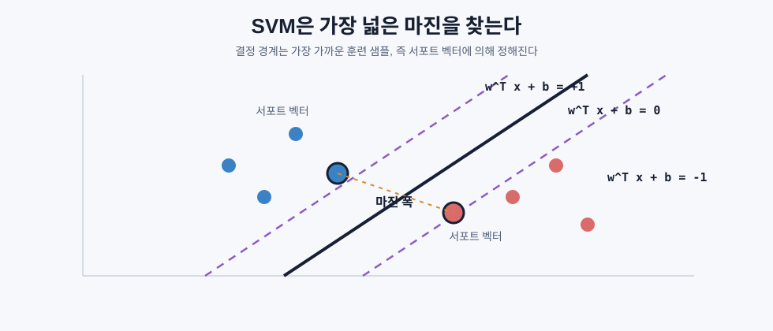
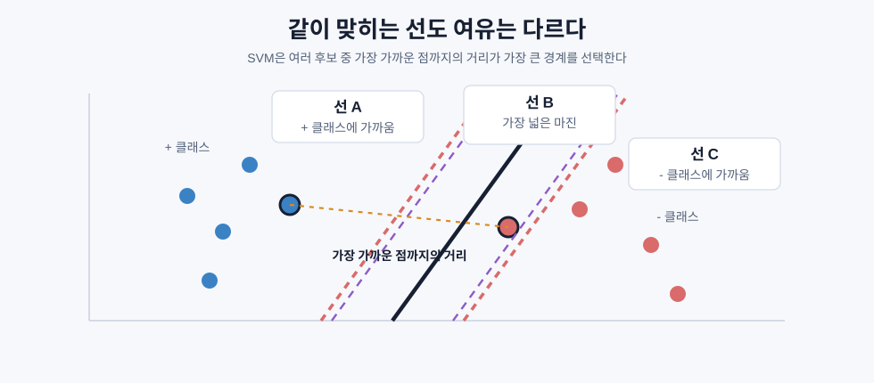
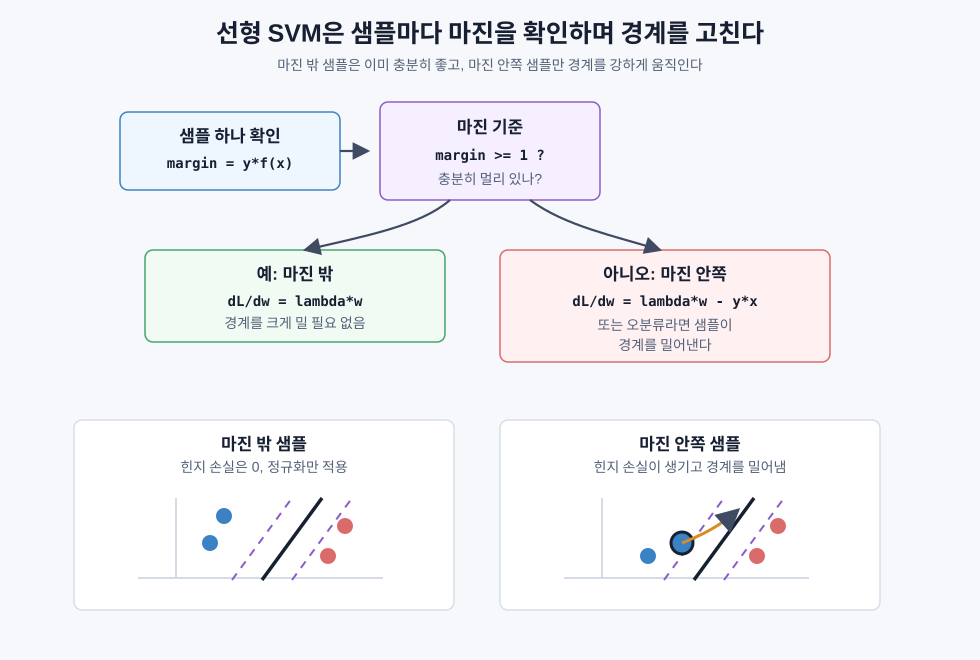
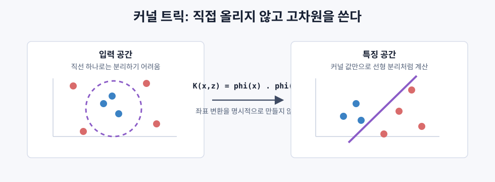

# 서포트 벡터 머신

> SVM은 두 클래스를 가르는 경계 중 가장 넓은 마진을 만드는 경계를 선택한다.

## 핵심 아이디어

두 클래스를 나누는 직선은 여러 개일 수 있다. SVM은 그중에서 가장 가까운 훈련 샘플까지의 거리가 가장 큰 경계를 고른다.

```text
목표:
그냥 나누는 선이 아니라,
양쪽 클래스에서 가장 가까운 점들과 최대한 멀리 떨어진 선을 찾는다.
```

이때 결정 경계와 가장 가까운 점들을 서포트 벡터라고 한다. SVM의 경계는 전체 데이터가 아니라 이 중요한 몇 개의 점에 의해 결정된다.



SVM은 작은 데이터, 고차원 데이터, 텍스트 분류처럼 특징 수가 많은 문제에서 여전히 강력하다. 특히 수학적으로 잘 정의된 볼록 최적화 문제에서 출발하기 때문에 해석과 이론적 보장이 좋다.

## 최대 마진 분류기

두 클래스를 나누는 선이 하나만 있는 것은 아니다. 아래처럼 여러 선이 모두 훈련 데이터를 맞게 나눌 수 있다.



```text
선 A: 두 클래스 사이를 지나가지만 한쪽 점에 너무 가까움
선 B: 두 클래스 사이의 가운데를 넓게 지나감
선 C: 맞게 나누기는 하지만 다른 쪽 점에 너무 가까움
```

SVM은 이 중에서 선 B처럼 가장 여유가 큰 선을 고른다. 여기서 여유가 바로 마진이다. 마진은 결정 경계와 가장 가까운 훈련 샘플 사이의 거리다.

직관적으로는 도로를 그리는 문제와 비슷하다. 양쪽에 두 종류의 점이 있고, 그 사이에 도로를 낸다고 생각해보자. 도로가 한쪽 점에 너무 붙어 있으면 새 점이 조금만 흔들려도 잘못 분류될 수 있다. 가장 넓은 도로를 내면 양쪽 점에서 모두 여유가 생긴다.

```text
좁은 마진:
훈련 데이터는 맞출 수 있지만, 새 데이터가 조금만 움직여도 경계를 넘을 수 있다.

넓은 마진:
훈련 데이터와 경계 사이에 여유가 있어 새 데이터에 더 안정적이다.
```

이 직관을 수식으로 쓰면 선형 SVM은 다음 초평면을 학습한다.

```text
w^T x + b = 0
```

- `w`: 경계의 방향을 정하는 가중치 벡터
- `b`: 경계를 평행 이동시키는 편향
- `x`: 입력 특징 벡터

`w^T x + b` 값은 점이 경계의 어느 쪽에 있는지 알려준다.

```text
w^T x + b > 0  -> + 클래스 쪽
w^T x + b < 0  -> - 클래스 쪽
w^T x + b = 0  -> 결정 경계 위
```

레이블은 보통 `{-1, +1}`로 둔다. 어떤 점 `x_i`가 올바르게 분류되려면 예측 방향과 정답 방향이 같아야 한다.

```text
y_i * (w^T x_i + b) > 0
```

예를 들어 정답이 `+1`인 점은 `w^T x_i + b`가 양수여야 하고, 정답이 `-1`인 점은 `w^T x_i + b`가 음수여야 한다. 둘을 곱하면 올바른 분류일 때 항상 양수가 된다.

점에서 결정 경계까지의 거리는 다음과 같다.

```text
distance = |w^T x_i + b| / ||w||
```

SVM은 가장 가까운 양쪽 점들이 `w^T x + b = +1`, `w^T x + b = -1`에 놓이도록 스케일을 잡는다. 그러면 두 마진 경계 사이의 폭은 다음처럼 된다.

```text
margin width = 2 / ||w||
```

따라서 마진을 넓히는 것은 `||w||`를 작게 만드는 것과 같다.

```text
minimize    (1/2) ||w||^2
subject to  y_i * (w^T x_i + b) >= 1  for all i
```

제약식의 의미는 모든 훈련 샘플이 단순히 맞게 분류되는 것에서 끝나지 않고, 최소한 마진 바깥에 있어야 한다는 뜻이다. 이 문제는 볼록 이차계획법이라 지역 최적해에 갇히는 문제가 아니라 전역 최적해를 찾는 구조다.

## 서포트 벡터

서포트 벡터는 마진 경계에 닿아 있는 훈련 샘플이다.

```text
y_i * (w^T x_i + b) = 1
```

이 점들이 결정 경계를 지탱한다. 마진 밖에 멀리 있는 점들은 경계에 직접 영향을 주지 않는다. 그래서 SVM의 예측은 데이터 전체보다 서포트 벡터에 더 의존한다.

서포트 벡터가 적다는 것은 경계가 일부 특이한 점에 과하게 휘둘리지 않는다는 신호일 수 있다. 반대로 서포트 벡터가 너무 많으면 많은 샘플이 경계 근처에 있거나 마진을 위반한다는 뜻이므로 일반화가 약할 수 있다.

## 소프트 마진과 C

현실 데이터는 완벽하게 선형 분리되지 않는 경우가 많다. 일부 점은 경계 안쪽에 있거나, 아예 반대편에 있을 수 있다. 소프트 마진 SVM은 이런 위반을 허용한다.

```text
minimize    (1/2) ||w||^2 + C * sum(xi_i)
subject to  y_i * (w^T x_i + b) >= 1 - xi_i
            xi_i >= 0
```

`xi_i`는 슬랙 변수다. 해당 샘플이 마진을 얼마나 위반했는지 나타낸다.

`C`는 마진 폭과 분류 오류 사이의 트레이드오프를 조절한다.

| C 값 | 동작 | 위험 |
|---|---|---|
| 큰 C | 위반을 강하게 벌한다. 오류를 줄이려 한다 | 마진이 좁아지고 과적합될 수 있다 |
| 작은 C | 위반을 더 허용한다. 넓은 마진을 선호한다 | 너무 단순해져 과소적합될 수 있다 |

중요한 점은 `C`가 정규화 강도의 역수처럼 동작한다는 것이다.

```text
큰 C = 약한 정규화
작은 C = 강한 정규화
```

## 힌지 손실

소프트 마진 문제는 제약식 없이 손실 함수로 쓸 수 있다.

```text
Loss = (1/2) ||w||^2
       + C * sum(max(0, 1 - y_i * (w^T x_i + b)))
```

또는 평균 손실과 정규화 항으로 다음처럼 쓴다.

```text
L(w, b)
  = (lambda / 2) * ||w||^2
    + (1/n) * sum(max(0, 1 - y_i * f(x_i)))
```

여기서 `f(x_i) = w^T x_i + b`다.

힌지 손실의 모양:

```text
loss
  |
  |\
  | \
  |  \
  |   \__________
  |
  +----|----|-----> y * f(x)
       0    1
```

- `y * f(x) >= 1`: 올바르게 분류되었고 마진 밖에 있으므로 손실이 `0`
- `0 < y * f(x) < 1`: 맞히긴 했지만 마진 안쪽이므로 벌점
- `y * f(x) <= 0`: 잘못 분류되었으므로 더 큰 벌점

로지스틱 회귀의 로지스틱 손실은 모든 점에 부드럽게 영향을 받는다. 반면 힌지 손실은 마진 밖의 점이 손실에 기여하지 않으므로, 서포트 벡터 중심의 희소한 해를 만든다.

| 손실 | 식 | 특징 |
|---|---|---|
| 힌지 손실 | `max(0, 1 - y*f(x))` | 마진 밖이면 손실 0 |
| 로지스틱 손실 | `log(1 + exp(-y*f(x)))` | 매끄럽고 모든 점이 영향 |

## 경사하강법으로 선형 SVM 학습하기

선형 SVM은 제약 최적화 문제를 직접 풀 수도 있지만, 힌지 손실에 경사하강법을 적용해 학습할 수도 있다. 이를 원시 문제 관점의 학습이라고 볼 수 있다.



단일 샘플에 대해 마진을 계산한다.

```text
margin_i = y_i * (w^T x_i + b)
```

마진이 충분하면 힌지 손실은 `0`이므로 정규화 항만 작동한다.

```text
if margin_i >= 1:
    dL/dw = lambda * w
    dL/db = 0
```

마진 안쪽이거나 오분류라면 해당 샘플을 올바른 방향으로 밀어야 한다.

```text
if margin_i < 1:
    dL/dw = lambda * w - y_i * x_i
    dL/db = -y_i
```

업데이트는 일반적인 경사하강법과 같다.

```text
w = w - learning_rate * dL/dw
b = b - learning_rate * dL/db
```

이 방식은 한 에폭당 대략 `O(n * d)`로 동작한다. 샘플 수가 `n`, 특징 수가 `d`일 때 특히 큰 희소 텍스트 데이터에서 선형 SVM이 빠르게 동작하는 이유다.

## 커널 트릭

선형 경계로 나눌 수 없는 데이터도 있다. 예를 들어 한 클래스가 원 안쪽에 있고 다른 클래스가 바깥쪽에 있다면 2차원 평면에서 직선 하나로는 분리하기 어렵다.

아이디어는 데이터를 더 높은 차원의 특징 공간으로 보낸 뒤, 그 공간에서 선형 경계를 찾는 것이다. 문제는 명시적으로 고차원 특징을 만들면 계산량이 너무 커진다는 점이다.

SVM의 쌍대 문제는 데이터 사이의 내적만 사용한다.

```text
maximize    sum(alpha_i)
            - (1/2) * sum_ij(alpha_i * alpha_j * y_i * y_j * (x_i . x_j))
subject to  0 <= alpha_i <= C
            sum(alpha_i * y_i) = 0
```

여기서 `x_i . x_j`를 커널 함수 `K(x_i, x_j)`로 바꾸면, 실제 고차원 좌표를 만들지 않고도 고차원 공간에서의 내적을 계산한 것처럼 학습할 수 있다.

```text
K(x, z) = phi(x) . phi(z)
```



대표 커널:

| 커널 | 식 | 쓰임 |
|---|---|---|
| 선형 | `K(x, z) = x . z` | 원래 공간에서 선형 분리 가능할 때 |
| 다항 | `K(x, z) = (x . z + c)^d` | 특징들의 다항 조합이 중요할 때 |
| RBF | `K(x, z) = exp(-gamma * ||x - z||^2)` | 부드러운 비선형 경계가 필요할 때 |

RBF 커널은 가까운 점끼리는 값이 `1`에 가깝고, 먼 점끼리는 `0`에 가까운 유사도를 만든다. 매우 유연하지만 `C`와 `gamma`를 잘못 고르면 쉽게 과적합될 수 있다.

## SVM 회귀

SVM은 회귀에도 쓸 수 있다. Support Vector Regression, 즉 SVR은 예측선 주변에 폭 `epsilon`의 관을 만든다. 이 관 안에 들어온 점은 손실이 `0`이고, 바깥에 있는 점만 벌점을 받는다.

```text
minimize    (1/2) ||w||^2 + C * sum(xi_i + xi_i*)
subject to  y_i - (w^T x_i + b) <= epsilon + xi_i
            (w^T x_i + b) - y_i <= epsilon + xi_i*
            xi_i, xi_i* >= 0
```

```text
epsilon이 큼  -> 관이 넓음 -> 서포트 벡터 적음 -> 더 부드러운 예측
epsilon이 작음 -> 관이 좁음 -> 서포트 벡터 많음 -> 더 민감한 예측
```

## 스케일링이 중요한 이유

SVM은 거리와 마진을 기반으로 한다. 특징의 단위가 서로 크게 다르면 큰 스케일의 특징이 거리 계산을 지배한다.

예를 들어 `나이`는 20에서 80 사이인데 `연봉`은 수천만 단위라면, SVM은 연봉 축의 차이를 훨씬 크게 느낀다. 그래서 SVM을 쓸 때는 보통 표준화를 먼저 한다.

```text
x_scaled = (x - mean) / std
```

실무에서는 `StandardScaler`와 `SVC` 또는 `LinearSVC`를 파이프라인으로 묶는 방식이 흔하다.

```text
원본 특징 -> 표준화 -> SVM 학습 -> 예측
```

## 언제 SVM을 쓰는가

| 상황 | SVM이 잘 맞는 이유 |
|---|---|
| 작은 데이터셋 | 복잡한 딥러닝보다 안정적일 수 있다 |
| 고차원 희소 데이터 | 선형 SVM이 빠르고 강하다 |
| 텍스트 TF-IDF 분류 | 많은 단어 특징을 잘 다룬다 |
| 명확한 마진 구조 | 최대 마진 원리가 잘 작동한다 |
| 이론적 보장이 필요함 | 볼록 최적화와 마진 기반 해석이 가능하다 |
| 비선형 경계가 필요하지만 데이터가 크지 않음 | RBF, 다항 커널을 쓸 수 있다 |

반대로 데이터가 매우 크면 커널 SVM은 느릴 수 있다. 커널 SVM은 보통 샘플 수에 대해 `O(n^2)`에서 `O(n^3)`까지 부담이 커질 수 있다. 이미지, 음성, 긴 텍스트처럼 원시 데이터에서 특징 자체를 배워야 하는 문제는 딥러닝이 더 강하다.

## 한눈에 정리

| 개념 | 핵심 |
|---|---|
| SVM | 가장 넓은 마진을 만드는 결정 경계를 찾는 모델 |
| 결정 경계 | `w^T x + b = 0` |
| 마진 | 결정 경계와 가장 가까운 샘플 사이의 거리 |
| 서포트 벡터 | 마진에 닿아 경계를 결정하는 핵심 샘플 |
| 하드 마진 | 모든 샘플을 완벽히 분리해야 하는 SVM |
| 소프트 마진 | 일부 마진 위반을 허용하는 SVM |
| C | 오류 허용과 마진 폭의 트레이드오프 |
| 힌지 손실 | `max(0, 1 - y*f(x))` |
| 커널 트릭 | 고차원 매핑을 직접 만들지 않고 내적만 계산하는 방법 |
| RBF 커널 | 거리 기반 유사도로 부드러운 비선형 경계를 만드는 커널 |
| SVR | epsilon 관 밖의 오차만 벌하는 SVM 회귀 |
