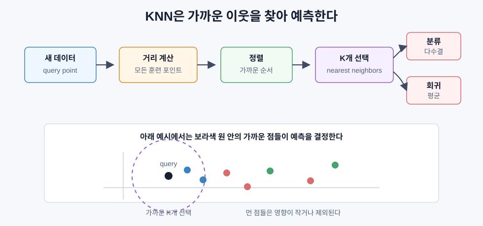
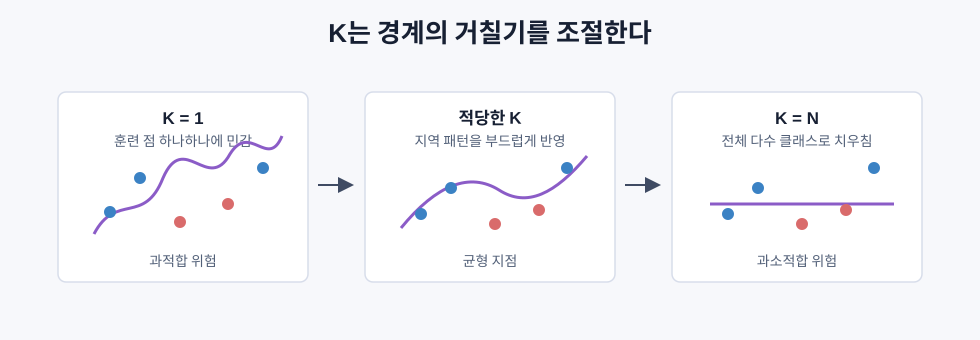
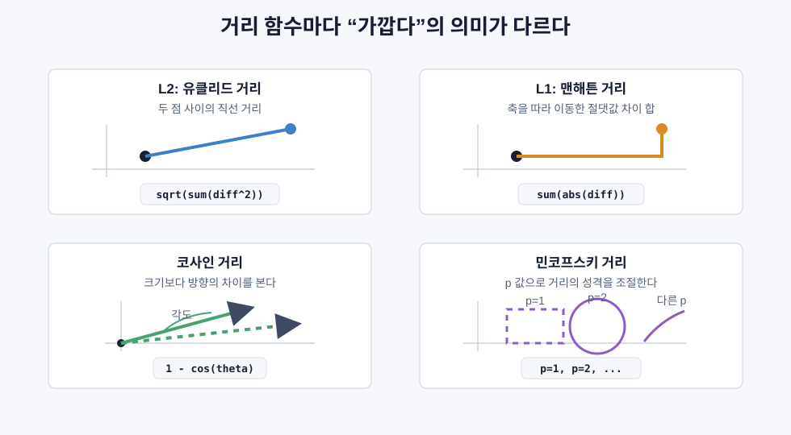
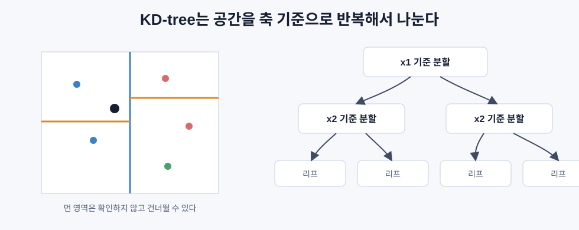
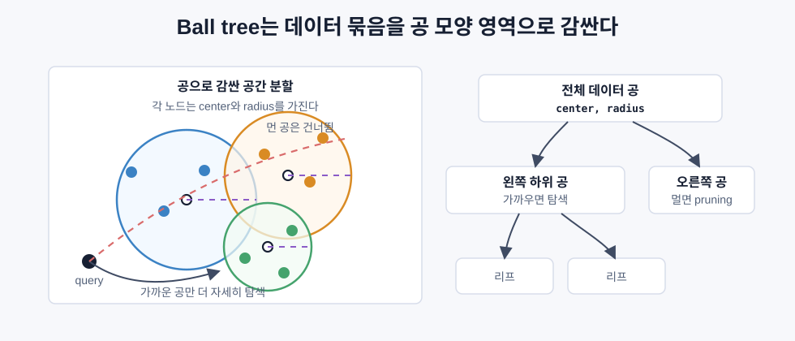

# K-최근접 이웃과 거리

> KNN은 학습 데이터를 그대로 저장해두고, 새 데이터가 오면 가장 가까운 이웃 K개를 보고 예측한다.

## 핵심 아이디어

K-최근접 이웃, 즉 KNN은 매우 단순하다. 모델이 별도의 가중치를 학습하지 않는다. 훈련 단계에서는 데이터를 저장하고, 예측 단계에서 새 데이터와 훈련 데이터 사이의 거리를 계산한다.



분류 문제에서는 가까운 이웃들이 투표한다.

```text
K = 5
가까운 이웃의 라벨: 고양이, 고양이, 강아지, 고양이, 강아지
-> 고양이 3표, 강아지 2표
-> 예측: 고양이
```

회귀 문제에서는 가까운 이웃들의 값을 평균낸다.

```text
K = 3
가까운 이웃의 집값: 6.8억, 7.1억, 7.0억
-> 예측: 평균인 6.97억
```

KNN은 “학습한다”기보다 “기억해두고, 필요할 때 비교한다”에 가깝다. 그래서 지연 학습(lazy learning)의 대표 예시다.

## 알고리즘 흐름

KNN의 예측 절차는 다음과 같다.

```text
1. 새 데이터 x_query가 들어온다.
2. x_query와 모든 훈련 데이터 사이의 거리를 계산한다.
3. 거리가 가까운 순서로 정렬한다.
4. 가장 가까운 K개를 선택한다.
5. 분류면 다수결, 회귀면 평균으로 예측한다.
```

별도의 손실 함수나 경사하강법은 없다. 대신 예측할 때마다 전체 훈련 데이터와 비교해야 하므로, 데이터가 커지면 예측 비용이 커진다.

```text
브루트포스 KNN 예측 비용 = O(n * d)
```

- `n`: 훈련 샘플 수
- `d`: 특징 수

## K 값 선택

`K`는 KNN의 가장 중요한 하이퍼파라미터다. `K`가 작으면 가까운 점 몇 개에 민감하고, `K`가 크면 전체적인 평균에 가까워진다.



| K | 동작 | 위험 |
|---|---|---|
| `K = 1` | 가장 가까운 한 점만 본다 | 노이즈까지 따라가 과적합되기 쉽다 |
| 작은 K | 지역 구조를 잘 반영한다 | 이상치에 민감할 수 있다 |
| 큰 K | 경계가 부드러워진다 | 세부 패턴을 놓쳐 과소적합될 수 있다 |
| `K = N` | 전체 다수 클래스나 전체 평균에 가까워진다 | 입력과 무관한 예측이 된다 |

이진 분류에서는 동률을 피하려고 홀수 K를 자주 쓴다. 출발점으로는 `sqrt(N)` 근처를 시도해볼 수 있지만, 실제로는 검증 데이터로 고르는 편이 좋다.

## 거리 함수

KNN에서 “가깝다”는 말은 거리 함수가 결정한다. 거리 함수가 바뀌면 이웃도 바뀌고, 예측도 바뀐다.

### L2 거리: 유클리드 거리

가장 흔한 직선 거리다.

```text
d(a, b) = sqrt(sum((a_i - b_i)^2))
```

공간 좌표나 비슷한 스케일의 연속형 특징에 잘 맞는다. 다만 차이를 제곱하기 때문에 큰 차이에 민감하다.

### L1 거리: 맨해튼 거리

각 차원의 절댓값 차이를 더한다.

```text
d(a, b) = sum(|a_i - b_i|)
```

L2보다 이상치에 덜 민감하다. 격자형 이동, 카운트형 특징, 일부 고차원 희소 데이터에서 유용하다.

### 코사인 거리

벡터의 크기보다 방향을 본다.

```text
d(a, b) = 1 - (a . b) / (||a|| * ||b||)
```

문서 임베딩이나 텍스트 벡터에서는 크기보다 방향이 의미를 더 잘 담는 경우가 많다. 그래서 검색, 추천, RAG의 벡터 검색에서 자주 쓰인다.

### 민코프스키 거리

L1과 L2를 일반화한 형태다.

```text
d(a, b) = (sum(|a_i - b_i|^p))^(1/p)

p = 1 -> L1
p = 2 -> L2
p -> inf -> 체비셰프 거리
```

데이터에 따라 `p`를 조절해 거리의 민감도를 바꿀 수 있다.



## 어떤 거리를 쓸까

| 데이터 | 추천 거리 | 이유 |
|---|---|---|
| 스케일이 비슷한 숫자 특징 | L2 | 기본값으로 잘 작동한다 |
| 이상치가 있는 숫자 특징 | L1 | 큰 차이를 과하게 키우지 않는다 |
| 텍스트/문서 임베딩 | 코사인 | 벡터 방향이 의미를 잘 담는다 |
| 고차원 희소 데이터 | 코사인 또는 L1 | L2는 고차원에서 약해지기 쉽다 |
| 혼합형 특징 | 사용자 정의 거리 | 숫자, 범주, 순서형 특징을 따로 다뤄야 한다 |

중요한 점은 거리 기반 알고리즘은 특징 스케일에 민감하다는 것이다.

```text
나이: 20 ~ 80
연봉: 3000만 ~ 2억
```

이 상태에서 그대로 L2 거리를 쓰면 연봉 차이가 거리 계산을 지배한다. 그래서 KNN에서는 표준화가 거의 필수다.

```text
x_scaled = (x - mean) / std
```

## 거리 가중 KNN

일반 KNN은 가까운 이웃 K개를 모두 같은 무게로 본다. 하지만 거리 `0.1`인 이웃과 거리 `5.0`인 이웃이 같은 영향력을 갖는 것은 어색할 수 있다.

거리 가중 KNN은 가까운 이웃에 더 큰 가중치를 준다.

```text
weight_i = 1 / (distance_i + epsilon)
```

`epsilon`은 거리가 0일 때 나누기 오류를 막는 작은 값이다.

분류에서는 가중 투표를 한다.

```text
가까운 고양이: weight 10
먼 강아지 2개: weight 2 + 2
-> 개수는 강아지가 많아도, 가중합은 고양이가 크다
```

회귀에서는 가중 평균을 쓴다.

```text
prediction = sum(w_i * y_i) / sum(w_i)
```

이 방식은 먼 이웃의 영향을 줄이기 때문에 K 선택에 조금 덜 민감해질 수 있다.

## 차원의 저주

KNN은 차원이 높아질수록 약해진다. 이유는 고차원에서는 거리의 의미가 흐려지기 때문이다.

낮은 차원에서는 가까운 점과 먼 점의 차이가 분명하다. 하지만 차원이 높아질수록 모든 점이 서로 비슷하게 멀어진다.

```text
2차원:
가까운 점과 먼 점의 거리 차이가 큼

100차원:
가장 가까운 점과 가장 먼 점의 거리 차이가 작아짐

1000차원:
"가깝다"는 말 자체가 약해짐
```

이를 거리 집중(distance concentration)이라고 볼 수 있다.

```text
max_dist / min_dist -> 1에 가까워짐
```

또 하나의 문제는 공간의 부피가 폭발한다는 점이다. 고차원에서 충분한 이웃을 찾으려면 매우 넓은 영역을 봐야 하고, 그 영역은 사실상 전체 공간에 가까워진다.

실무적으로 KNN은 대략 수십 차원까지는 쓸 만하지만, 수백 차원 이상에서는 차원 축소나 임베딩 품질, 거리 함수 선택이 훨씬 중요해진다.

## KD-tree

브루트포스 KNN은 매번 모든 점과 거리를 계산한다. 데이터가 크면 느리다. KD-tree는 공간을 나무 구조로 나눠서 가까울 가능성이 낮은 영역을 건너뛰게 해준다.



KD-tree는 차원을 번갈아 가며 중앙값 기준으로 데이터를 나눈다.

```text
1. x1 축의 중앙값으로 나눈다.
2. 왼쪽/오른쪽 노드에서 x2 축의 중앙값으로 나눈다.
3. 다음 깊이에서는 x3 또는 다시 x1 축을 쓴다.
4. 리프까지 반복한다.
```

낮은 차원에서는 평균적으로 `O(log n)`에 가까운 검색을 기대할 수 있다. 하지만 차원이 높아지면 가지치기가 잘 되지 않아 결국 `O(n)`에 가까워진다.

## Ball tree와 근사 최근접 탐색

KD-tree는 축에 평행한 박스로 공간을 나눈다. Ball tree는 중심과 반지름을 가진 공 모양 영역으로 데이터를 나눈다. 중간 정도 차원에서는 Ball tree가 KD-tree보다 나을 수 있다.

하지만 수백만 개의 고차원 벡터를 검색하는 경우에는 정확한 KNN보다 근사 최근접 탐색을 많이 쓴다.



| 방법 | 특징 |
|---|---|
| KD-tree | 저차원에서 빠른 정확 탐색 |
| Ball tree | 중간 차원에서 더 나을 수 있음 |
| HNSW, IVF, PQ | 대규모 벡터 검색에서 쓰는 근사 탐색 |
| 벡터 데이터베이스 | 임베딩 검색과 필터링, 인덱싱을 함께 제공 |

RAG에서 문서 조각을 찾거나 추천 시스템에서 비슷한 아이템을 찾는 것도 본질적으로는 KNN 검색이다.

## 지연 학습과 즉시 학습

KNN은 지연 학습이다. 훈련 때는 거의 아무 일도 하지 않고, 예측 때 모든 일을 한다.

| 구분 | KNN 같은 지연 학습 | SVM/신경망 같은 즉시 학습 |
|---|---|---|
| 훈련 시간 | 데이터를 저장하면 끝 | 파라미터를 학습해야 함 |
| 예측 시간 | 느릴 수 있음 | 보통 빠름 |
| 저장할 것 | 전체 훈련 데이터 | 모델 파라미터 |
| 새 데이터 반영 | 추가하기 쉬움 | 보통 재학습 필요 |
| 결정 경계 | 예측 시점에 암묵적으로 계산 | 학습 후 고정 |

데이터가 자주 바뀌거나, 훈련 시간을 거의 쓰고 싶지 않거나, 데이터가 작을 때 KNN은 좋은 선택이 될 수 있다.

## KNN 회귀

KNN은 분류뿐 아니라 회귀에도 쓸 수 있다. 분류에서는 이웃들이 투표하고, 회귀에서는 이웃들의 타깃 값을 평균낸다.

```text
prediction = (1/K) * sum(y_i for i in K nearest neighbors)
```

거리 가중 회귀는 더 가까운 이웃에 더 큰 무게를 준다.

```text
prediction = sum(w_i * y_i) / sum(w_i)
```

KNN 회귀는 훈련 데이터 범위 밖으로 잘 외삽하지 못한다. 이웃 값들의 평균을 내기 때문이다.

```text
훈련 y 값 범위: 0 ~ 100
KNN 회귀 예측: 보통 0 ~ 100 안쪽
```

따라서 이미 본 데이터 근처에서 보간하는 문제에는 자연스럽지만, 데이터 밖의 추세를 예측해야 하는 문제에는 약하다.

## 한눈에 정리

| 개념 | 핵심 |
|---|---|
| KNN | 가까운 K개 훈련 샘플을 보고 예측하는 알고리즘 |
| K | 경계의 거칠기와 부드러움을 조절하는 값 |
| L2 거리 | 직선 거리. 기본값으로 많이 쓰임 |
| L1 거리 | 절댓값 차이 합. 이상치에 비교적 덜 민감 |
| 코사인 거리 | 벡터 방향을 비교. 텍스트/임베딩에 자주 사용 |
| 거리 가중 KNN | 가까운 이웃에 더 큰 영향력을 주는 방식 |
| 차원의 저주 | 고차원에서 거리 차이가 희미해지는 현상 |
| KD-tree | 저차원 최근접 탐색을 빠르게 하는 공간 분할 트리 |
| 지연 학습 | 훈련 때 저장만 하고 예측 때 계산하는 방식 |
| KNN 회귀 | 가까운 이웃들의 타깃 평균으로 숫자를 예측 |
