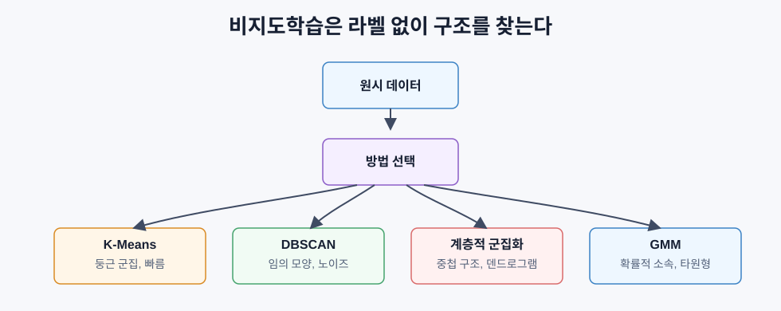
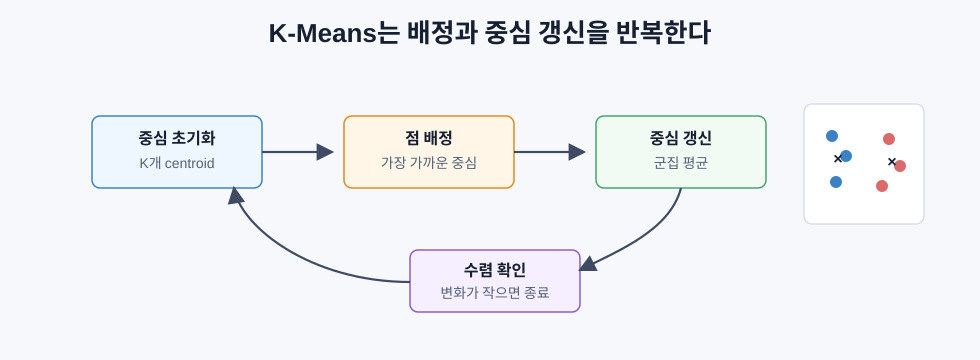
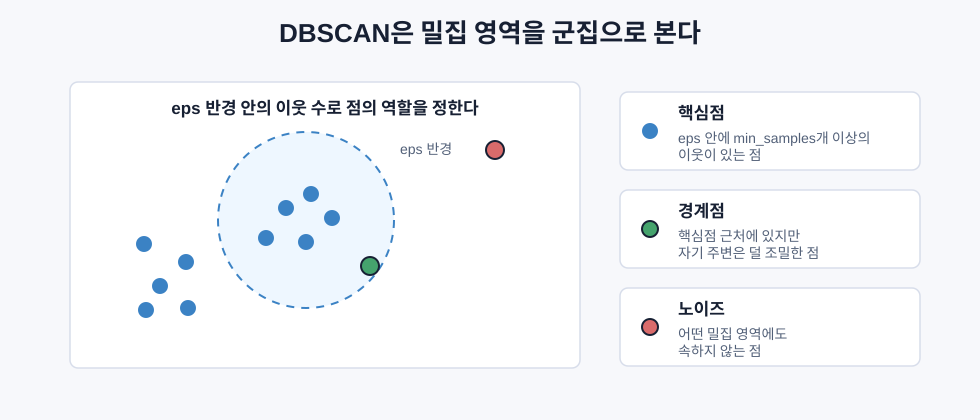

# 비지도학습

> 비지도학습은 정답 라벨 없이 데이터 안의 구조를 찾는 방법이다.

## 핵심 아이디어

지도학습은 입력과 정답이 함께 있다. 비지도학습은 정답 없이 입력 데이터만 있다. 모델은 “무엇이 정답인지” 배우는 대신, 데이터 안에서 반복되는 구조를 찾는다.

```text
지도학습:
입력 x + 정답 y -> x에서 y를 예측하는 규칙 학습

비지도학습:
입력 x만 있음 -> 비슷한 것끼리 묶거나, 숨은 구조를 찾음
```



예를 들어 고객 데이터에 라벨이 없어도 구매 패턴이 비슷한 고객군을 찾을 수 있다. 네트워크 로그에 “정상/공격” 라벨이 없어도 평소와 다른 이상한 패턴을 찾을 수 있다.

단점도 분명하다. 정답이 없기 때문에 “맞았다/틀렸다”를 직접 계산하기 어렵다. 그래서 군집 품질을 보는 지표나, 사람이 해석할 수 있는 업무적 기준이 중요하다.

## 군집화

군집화는 비슷한 데이터끼리 같은 그룹으로 묶는 작업이다.

```text
목표:
같은 군집 안의 점들은 서로 비슷하게,
다른 군집의 점들과는 다르게 만든다.
```

여기서 “비슷하다”는 거리 함수와 알고리즘에 따라 달라진다. K-Means는 중심점까지의 거리를 보고, DBSCAN은 주변 밀도를 보고, GMM은 확률 분포를 본다.

## K-Means

K-Means는 데이터를 정확히 `K`개의 군집으로 나눈다. 각 군집은 중심점, 즉 centroid를 가진다. 각 데이터는 가장 가까운 중심점의 군집에 속한다.



Lloyd 알고리즘은 다음을 반복한다.

```text
1. K개의 중심점을 초기화한다.
2. 각 점을 가장 가까운 중심점에 배정한다.
3. 각 군집의 평균을 새 중심점으로 계산한다.
4. 배정이나 중심점이 거의 변하지 않을 때까지 반복한다.
```

K-Means가 줄이려는 값은 inertia다. 각 점과 자신이 속한 군집 중심 사이의 제곱거리 합이다.

```text
inertia = sum(||x_i - centroid_assigned(i)||^2)
```

inertia가 작다는 것은 각 점이 자기 군집 중심에 가깝다는 뜻이다. 즉 군집이 조밀하다는 뜻이다.

K-Means는 빠르고 단순하지만 몇 가지 가정이 있다.

- 군집이 둥근 모양에 가까울 때 잘 작동한다.
- 군집 크기와 밀도가 비슷할수록 좋다.
- `K`를 미리 정해야 한다.
- 초기 중심점에 따라 결과가 달라질 수 있다.
- 이상치에 민감할 수 있다.

## K 선택하기

K-Means에서는 K를 직접 정해야 한다. 대표적으로 엘보 방법과 실루엣 점수를 쓴다.

### 엘보 방법

여러 K에 대해 K-Means를 실행하고 inertia를 그린다.

```text
K = 1 -> inertia 큼
K = 2 -> 크게 감소
K = 3 -> 또 감소
K = 4 -> 조금만 감소
K = 5 -> 거의 변화 없음
```

감소 폭이 급격히 줄어드는 지점을 팔꿈치(elbow)라고 부른다. 그 지점이 적절한 K의 후보가 된다.

### 실루엣 점수

실루엣 점수는 한 점이 자기 군집 안에서는 얼마나 잘 어울리고, 다른 군집과는 얼마나 떨어져 있는지를 본다.

```text
a = 같은 군집 안의 다른 점들과의 평균 거리
b = 가장 가까운 다른 군집까지의 평균 거리

silhouette = (b - a) / max(a, b)
```

값의 범위는 대략 `-1`에서 `1`이다.

| 값 | 의미 |
|---|---|
| `1`에 가까움 | 자기 군집에는 가깝고 다른 군집과는 멀다 |
| `0` 근처 | 군집 경계에 있다 |
| 음수 | 다른 군집에 더 가까울 수 있다 |

엘보 방법은 직관적이고, 실루엣 점수는 군집의 분리 정도를 수치로 비교하기 좋다.

## DBSCAN

DBSCAN은 밀도 기반 군집화다. K-Means처럼 군집 수 K를 미리 정하지 않는다. 대신 “주변에 점이 충분히 많이 모인 곳”을 군집으로 본다.



DBSCAN의 두 파라미터:

| 파라미터 | 의미 |
|---|---|
| `eps` | 이웃으로 볼 반경 |
| `min_samples` | 밀집 영역으로 인정할 최소 이웃 수 |

점은 세 종류로 나뉜다.

| 점 유형 | 의미 |
|---|---|
| 핵심점 | `eps` 반경 안에 `min_samples`개 이상의 점이 있음 |
| 경계점 | 핵심점 근처에 있지만, 자기 주변은 충분히 조밀하지 않음 |
| 노이즈점 | 어떤 핵심점의 밀집 영역에도 속하지 않음 |

DBSCAN은 가까운 핵심점들을 연결해 하나의 군집으로 만든다. 경계점은 가까운 핵심점의 군집에 붙고, 노이즈점은 군집에 넣지 않는다.

DBSCAN의 장점:

- 군집 수를 미리 정하지 않아도 된다.
- 둥글지 않은 군집도 찾을 수 있다.
- 노이즈와 이상치를 자연스럽게 찾아낸다.

단점:

- 밀도가 다른 군집들이 섞여 있으면 어렵다.
- `eps`와 `min_samples` 선택에 민감하다.
- 고차원에서는 거리 기반 밀도 판단이 약해진다.

## 계층적 군집화

계층적 군집화는 군집의 나무 구조를 만든다. 대표적인 방식은 병합형(agglomerative)이다.

```text
1. 처음에는 각 점이 자기만의 군집이다.
2. 가장 가까운 두 군집을 합친다.
3. 다시 가장 가까운 두 군집을 합친다.
4. 하나의 큰 군집이 될 때까지 반복한다.
5. 원하는 높이에서 나무를 자르면 K개의 군집을 얻는다.
```

이 나무 구조를 덴드로그램이라고 한다. 덴드로그램을 보면 어떤 군집들이 어떤 순서로 합쳐졌는지 알 수 있다.

군집 사이의 거리를 재는 방식도 여러 가지다.

| 방식 | 의미 | 특징 |
|---|---|---|
| 단일 연결 | 두 군집에서 가장 가까운 점 사이 거리 | 길게 이어지는 군집을 만들 수 있음 |
| 완전 연결 | 가장 먼 점 사이 거리 | 조밀한 군집을 선호 |
| 평균 연결 | 모든 점 쌍 거리의 평균 | 중간적인 성격 |
| Ward 방법 | 합쳤을 때 분산 증가가 가장 작은 쌍 선택 | K-Means와 비슷하게 조밀한 군집 선호 |

계층적 군집화는 작은 데이터에서 구조를 살펴보기 좋지만, 큰 데이터에서는 메모리와 계산 비용이 커진다.

## 가우시안 혼합 모델

GMM은 데이터가 여러 개의 가우시안 분포에서 섞여 나왔다고 가정한다. K-Means가 각 점을 하나의 군집에 딱 배정한다면, GMM은 각 점이 여러 군집에 속할 확률을 계산한다.

```text
K-Means:
이 점은 2번 군집이다.

GMM:
이 점은 1번 군집일 확률 0.1,
2번 군집일 확률 0.8,
3번 군집일 확률 0.1이다.
```

GMM은 평균과 공분산을 가진 가우시안들을 학습한다. 그래서 둥근 군집뿐 아니라 타원형 군집도 표현할 수 있다.

학습에는 EM 알고리즘을 쓴다.

```text
E-step:
현재 가우시안들로 각 점의 군집 소속 확률을 계산한다.

M-step:
그 확률을 가중치로 사용해 각 가우시안의 평균, 공분산, 혼합 비율을 갱신한다.
```

이 과정을 가능도가 더 이상 크게 좋아지지 않을 때까지 반복한다.

## 언제 어떤 방법을 쓸까

| 방법 | 잘 맞는 상황 | 피해야 할 상황 |
|---|---|---|
| K-Means | 데이터가 크고, 군집이 둥글고, K를 대략 알 때 | 비정형 모양, 이상치가 많을 때 |
| DBSCAN | 군집 수를 모르고, 모양이 불규칙하고, 이상치를 찾고 싶을 때 | 밀도가 크게 다른 군집, 고차원 데이터 |
| 계층적 군집화 | 작은 데이터에서 중첩 구조를 보고 싶을 때 | 큰 데이터 |
| GMM | 겹치는 군집, 소프트 할당, 타원형 구조 | 너무 큰 데이터, 차원이 너무 높은 데이터 |

한 알고리즘이 항상 이기지는 않는다. 데이터의 모양, 차원, 이상치, 필요한 해석 방식에 따라 선택해야 한다.

## 이상 탐지

군집화는 이상 탐지에도 자연스럽게 쓰인다. 정상 데이터는 보통 어떤 군집 안에 모이고, 이상한 데이터는 군집에서 멀리 떨어져 있거나 밀도가 낮은 곳에 있다.

| 방법 | 이상치 판단 방식 |
|---|---|
| K-Means | 어떤 중심점에서도 너무 멀리 떨어진 점 |
| DBSCAN | 노이즈점으로 분류된 점 |
| GMM | 모든 가우시안에서 확률이 낮은 점 |

예를 들어 결제 로그에서 대부분의 사용자는 비슷한 금액과 시간대에 결제하지만, 갑자기 매우 큰 금액을 낯선 지역에서 결제한 기록은 군집에서 멀리 떨어질 수 있다.

## 평가가 어려운 이유

비지도학습에는 정답 라벨이 없다. 그래서 정확도처럼 단순한 평가 지표를 바로 쓰기 어렵다.

대신 다음을 함께 본다.

| 확인할 것 | 의미 |
|---|---|
| 군집이 조밀한가 | 같은 군집 안의 점들이 서로 가까운가 |
| 군집끼리 떨어져 있는가 | 다른 군집과 충분히 분리되어 있는가 |
| 업무적으로 해석 가능한가 | 고객군, 문서 주제, 이상 패턴으로 설명되는가 |
| 안정적인가 | 데이터 일부가 바뀌어도 비슷한 구조가 나오는가 |

실루엣 점수나 inertia는 좋은 출발점이지만, 최종적으로는 사람이 해석할 수 있는 구조인지 확인해야 한다.

## 한눈에 정리

| 개념 | 핵심 |
|---|---|
| 비지도학습 | 라벨 없이 데이터 구조를 찾는 학습 |
| 군집화 | 비슷한 점끼리 그룹으로 묶는 작업 |
| K-Means | K개 중심점으로 데이터를 나누는 빠른 군집화 |
| Centroid | 군집에 속한 점들의 평균 위치 |
| Inertia | 점과 중심점 사이의 제곱거리 합 |
| 엘보 방법 | K를 늘릴 때 inertia 감소가 둔해지는 지점 찾기 |
| 실루엣 점수 | 군집 안 응집도와 군집 간 분리도를 함께 보는 점수 |
| DBSCAN | 밀집 영역을 군집으로 보고 노이즈를 찾는 방법 |
| 핵심점 | eps 안에 충분한 이웃이 있는 점 |
| 계층적 군집화 | 점들을 점진적으로 합쳐 덴드로그램을 만드는 방법 |
| GMM | 여러 가우시안 분포의 혼합으로 데이터를 설명하는 모델 |
| EM 알고리즘 | 소속 확률 계산과 파라미터 갱신을 번갈아 반복 |
| 이상 탐지 | 군집에서 멀거나 확률이 낮은 점을 찾는 작업 |
